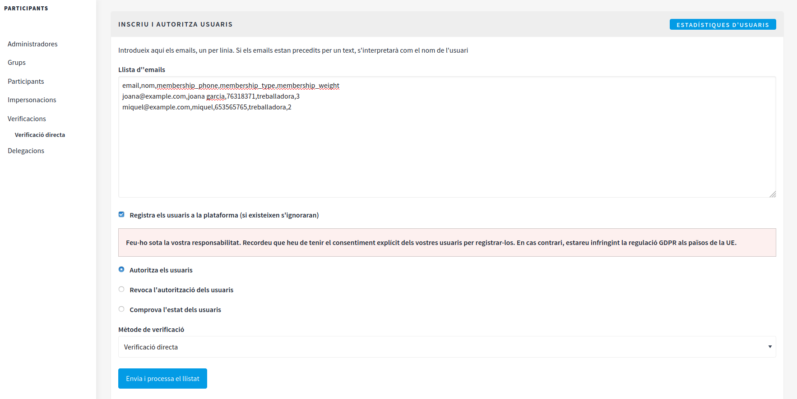
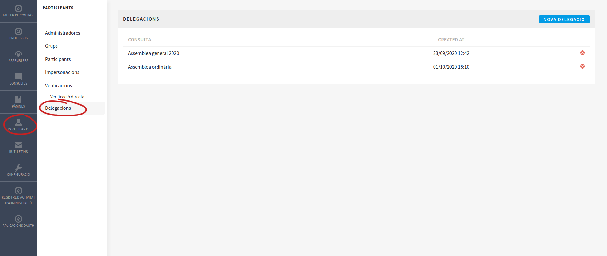
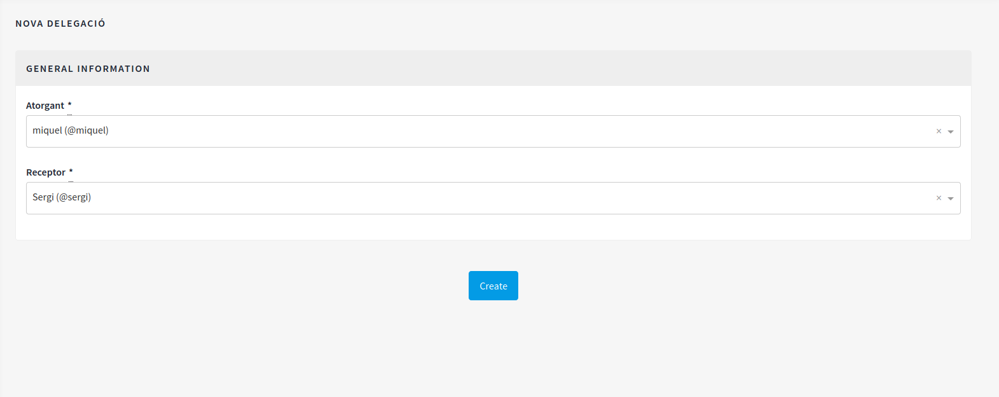

# 3. Manual per crear una votació societària virtual a Cercles.Coop
**Manual per crear una reunió societària: ordre del dia, documentació associada i paràmetres de votació de cada un dels punts de l'ordre del dia**

Per utilitzar la plataforma de votació Cercles.Coop s’ha d’haver sol·licitat la creació d’una [instància pròpia](https://cercles.coop). Així doncs, per implantar les passes del manual, assumim que ja teniu disponible una instància i un [sistema de emissió de vídeo](necessitats-tecniques-per-organitzar-i-celebrar-reunions-virtuals.md#1-emissio-de-video-en-directe) escollit. 



Per configurar la instància a nivell d’administrador, podeu consultar documentació més amplia a [https://docs.decidim.org]. No obstant això, si voleu fer servir les funcionalitats específiques per preparar la reunió societària que des de CoopCat s’ha validat, us recomanem seguir únicament aquesta guia. 



### Alta com a administradors a la plataforma Cercles.Coop

Al formalitzar l’alta d’instància a la plataforma CerclesCoop, a l’adreça electrònica facilitada en el formulari d’alta heu de rebre un correu electrònic amb l’enllaç d’accés específic, per a l’administrador de la cooperativa, a la plataforma (comprovar safata spam). 

Aquest enllaç serà únic per a cada cooperativa i condueix a l’espai de gestió a través del qual l’administrador crearà totes les reunions societàries i processos participatius que vulgui, sense limitacions.

Clicant l’enllaç, s’obre la plataforma de votació i apareix en pantalla un formulari d’ingrés: l'àlias apareix per defecte i només cal crear una contrasenya, confirmar-la i acceptar els **Termes i condicions d'ús** generals de la plataforma Cercles.Coop. La contrasenya d’accés com a administrador l'haureu de recordar, sinó es pot generar una nova contrasenya clicant sobre **has oblidat la teva contrasenya**, tal com es mostra a la imatges següent:


Un cop enregistrats, entrareu directament a la plataforma i haureu d'acceptar novament els **Termes i condicions d'ús**, en aquest cas, com a administradors a la plataforma. A continuació apareix en pantalla totes les opcions del **Tauler de control**. Al menú de dalt a la dreta apareixerà l’opció **Tauler de control**, tal i com es mostra a la imatge següent:


### Preparació de la reunió societària

Si fas servir el servei ofert per Cercles.Coop ja tindràs creat per defecte el contingut dels apartats Pàgines i Àmbits de la zona de configuració i, per tant, pots adreçar-te directament a la creació de la [Consulta](posada-en-marxa.md#consultes). 


El text estàndard que es proporciona a l'apartat de **Pàgines** cal adaptar-lo incorporant les dades de cada cooperativa.



#### Pàgines informatives

A la sessió *Pàgines* podem editar els continguts de les pàgines explicatives. En concret, es poden crear, editar i suprimir. Podem crear les pàgines que necessitem i obligatòriament caldrà crear les següents:

* FAQ \(preguntes freqüents\) **pages/faq**
* Termes i condicions **pages/terms-and-conditions**
* Accessibilitat **pages/accessibility**


Podeu descarregar-vos el text estàndard pàgines aquí, modificar-lo i copiar-lo a la pàgina que correspongui. ALERTAAAAAAAAAAAAAAAAAAAAAAAAAAAAAAA PUJAR DOCUMENTS I CREAR ENLLAÇOS.



#### **Àmbits**

Abans de crear un procés de votació (consulta), necessitem crear un àmbit. Els àmbits ens serveixen per classificar els tipus de processos participatius, per exemple: consultes al socis, consells rectors, assemblees..., si no esperem tenir diversitat d'àmbits sobre els quals realitzar consultes o processos de votació, podem crear-ne un d’únic anomenat, per exemple, "reunió societària" i després podem crear un subàmbit concret, per exemple, “Assemblea General”.



En el decurs d'aquest manual farem servir els exemples de **Reunió societària** per definir l'àmbit i **Assemblea General** per definir el subàmbit.


A la secció **Configuració &gt; Àmbits** fem clic a **Afegir**, a dalt a la dreta.

* **Nom:** Reunió societària
* **Codi:** reunio-societaria

Un cop creat l’àmbit general, fem clic a sobre **Reunió societària** i dins podrem **Afegir** un subàmbit que anomenarem:
* **Nom:** Assemblea General
* **Codi:** assemblea-general


El text de l'apartat **codi** no pot portar accents, dièresis, espais ni punt volat.



#### Consultes

El mòdul de consultes és el que farem servir per organitzar les votacions d’una determinada reunió, l'ordre del dia i la documentació associada. Si anem a la secció **Consultes** se’n poden crear tantes com vulguem, fent clic al botó **Nova consulta** de dalt a la dreta.



Programarem les assemblees i altres reunions societàries a través de l'apartat **Consultes**. L'apartat **Assemblees** és un apartat predefinit de la plataforma Decidim i té una funcionalitat diferent que no dona resposta, actualment, a les necessitats de les cooperatives, pel que fa a totes les opcions de vot social necessàries.


Hem d'omplir els camps següents:

* **Títol.** _Per exemple: Assemblea General Ordinària 2020_
* **Subtítol.** _Per exemple: Assemblea anual de socis de la Cooperativa, SCCL_
* **Descripció:** Afegir tota la informació relativa a com participar en la assemblea. _Com ara: Enllaç a la plataforma de videoconferència, hora de primera i segona convocatòria... _
* **Comença la votació:** Data de la assemblea
* **La votació finalitza:** Data de la assemblea
* **Abast destaca:** S'obrirà un desplegable i haurem d'escollir el subàmbit definit inicialment. _Per exemple: Assemblea General_
* **Nom curt d'URL** (sense espais, ni accents, ni dièresis, ni punt volat). _Per exemple: assemblea-general-2020_


Altres camps recomanats: 

* Imatge del banner: Podeu posar una matge corporativa. La  mida del banner serà de 1105x128. N'oferim un [model](../altres-recursos/imatges-per-defecte).
* URL de vídeo introductori \(podeu posar un video explicatiu o bé el video del broadcasting\)



Si emetem el video a través d'un sistema de broadcasting, com youtube, el podem afegir al camp **URL de vídeo introductori** [tal com s'explica aquí](../video-de-la-assemblea/videoconferencia/mode-broadcasting.md#mostrar-el-video-de-youtube-a-decidim).



Fins que no fem clic a **Publicar** la consulta no serà visible per als usuaris.



La consulta només s’obrirà a la data marcada. Mentrestant els socis poden entrar a la plataforma per consultar l’ordre del dia i la documentació associada, però no podran votar.

Quan vulguem obrir la votació, canviarem la data de **Comença la votació** a un dia anterior al de celebració de la reunió societària, quan vulguem tancar la votació mourem la data de **La votació finalitza** a un dia anterior al de celebració de la reunió societària.


Un cop haguem omplert la informacio general, haurem de crear les preguntes de la **consulta** i posteriorment les respostes. Un cop creades, a l'apartat d'informació general de la **consulta** apareixerà habilitada l'opció de **publicar** consulta. És a dir, fins que no haguem creat les preguntes amb les corresponents respostes i habilitar-les, no podrem habilitar la consulta.


#### Preguntes de la consulta

Dins de la Consulta creada podrem crear totes les preguntes i respostes possibles. Les preguntes equivalen a cada punt de l'ordre del dia de la reunió i les preguntes el sentit del vot que correspon a cada pregunta. Fem clic a **Preguntes** al menú lateral esquerra i després **Nova Pregunta** fent clic al botó de dalt a la dreta.


Hem d'omplir els següents camps:

* **Títol.** _Per exemple: Presentació i aprovació, si s’escau, de la Memòria de Sostenibilitat del 2019 de la Cooperativa, SCCL._
* **Subtítol** _Per exemple: A la primera pregunta de l'ordre del dia sotmetem a votació la memòria de sostenibilitat 2019 de la cooperativa_
* **Grup promotor**: Aquí detallarem qui eleva a la reunió societària la pregunta. _Per exemple: Consell Rector (en el cas que celebrem l'Assemblea)_
* **Àmbit participatiu**. _Per exemple: AGO 2020_
* **Què es decideix:** Podeu detallar els aspectes generals o més importants d'aquest punt de l'ordre del dia.
* **Àrea municipal:** Cal seleccionar el subàmbit a través del desplegable. _Per exemple: Assemblea General_
* **Nom curt d'URL** (sense espais, ni accents, ni dièresis, ni punt volat). _ Per exemple: pregunta-1_


Fent clic a la pregunta creada veurem que al menú lateral esquerra se'ns despleguen més opcions, **recomanem sols fer ús de les dues següents**: 

* Respostes \(podem crear totes les respostes que necessitem, habitualment: _A favor, En contra, En blanc_\)
* Adjunts \(documents de consulta que acompanyen la pregunta\)


Per poder publicar una pregunta cal que sempre es creïn les respostes possibles



Per tal de mantenir la compatibilitat amb la delegació de vot no tocarem la configuració de les preguntes.



Abans de publicar la pregunta ens assegurem que es requereixen les verificacions de identitat que considerem, fent clic sobre la icona amb forma de clau. 


A cercles.coop recomanem que estiguin marcades per totes les preguntes:  Verificació directa i SMS \(el que significa que sols poden contestar les preguntes de la assemblea les persones que hem convidat pel cens \(verificació directa\) i que a més han validat que tenen accés al seu telèfon mòbil\)


Un cop configurats els permisos d'accés a la pregunta podem fer clic sobre la icona amb forma de llapís i al final del formulari de configuració de la pregunta ens apareixerà la funció de publicar. 

#### Importació de les participants

Per poder incorporar el cens haurem d'anar al taulell d'administració &gt; **Participants** &gt; **Verificacions** &gt; **Direct Verifications**


Podrem fer proves de la importació i veure els resultats sense realitzar efectivament la importació de les sòcies si tenim marcada l'òpció \(marcada per defecte\) **Comprova l'estat dels usuaris**


Necessitarem un document amb format tipus CSV. On la primera linea és la capçalera, separant columnes amb comes i sense espais:

```text
email,nom,membership_phone,membership_type,membership_weight
```

Les següents línies son les dades, separant columnes amb comes i sense espais:

```text
email,nom,membership_phone,membership_type,membership_weight
joana@example.com,joana garcia,76318371,treballadora,3
miquel@example.com,miquel,653565765,treballadora,2
[...]
```

**membership\_type** i **membership\_weight** representen tipologia de sòcies, i ponderació del vot, respectivament aquesta dada es farà servir per mostrar resultats agrupant sòcies amb la mateixa tipologia i ponderació de vot. Per tant en el exemple si hem fet servir tipologia sòcia "treballadora" és important que fem servir exactament el mateix text per totes les sòcies de tipus "treballadora".


Important! Quan importem el cens de les sòcies, aquestes seran convidades per mail a entrar al Decidim i podran veure tot el que hi hagi públic. Ens hem d'assegurar que la consulta i les preguntes públicades són les que volem tenir disponibles perquè les sòcies puguin veure i reflexionar abans de la reunió, **però tenir la data de inici de la consulta en una data futura per tal de no permetre les votacions fins el dia de la reunió.** 

És recomanable haver explicat prèviament a les sòcies que rebran aquesta invitació amb la finalitat de realitzar una reunió amb votacions online. 


Quan vulguem importar el cens, que implica la invitació a les sòcies a entrar en el Decidim. Hem de canviar la opció seleccionada per defecte **Comprova l'estat dels usuaris** i marcar **Registra els usuaris a la plataforma \(si existeixen s'ignoraran\)** juntament amb **Autoritza els usuaris** 




Si hem d'actualitzar algun parametre de usuaris introduits \(tipus telefon, tipologia de sòcia o ponderació del vot\) podem fer servir el mateix format. Primer amb l'opció de **Revoca l'autorització dels usuaris** i posteriorment amb **Autoritza els usuaris**  amb les dades corregides.


#### Delegacions

Si necessitem realitzar delegacions de vots ho podem fer com administradores a **Participants &gt; Delegacions**



Podrem realitzar delegacions per diferents consultes \(diferentes reunions\). Fent clic a **Nova delegació** crearem la configuració per la consulta que desitgem, podem especificar **Consulta**, **Màxim nombre de delegacions que pot rebre una sòcia.**

Un cop creada la configuració per les delegacions d'una consulta si fem clic a sobre del nom de la consulta podrem crear les delegacions fent clic al botó **Nou Participant**


Podrem seleccionar qui és l'**atorgant** del vot i en qui delega \(**receptor**\) escrivint el nom d'usuari \(**àlies**\):




Si no coneixes l'àlies de l'usuari pots visualitzar-l'ho a l'adminitració **Participants &gt; Participants**


### Reunió

Ja ho tenim tot a punt per la reunió! Tenim un **Consulta** amb les seves **Preguntes** publicades tal com hem explicat anteriorment i la **Consulta** comença en una data futura, per aquest motiu les sòcies importades poden accedir a veure la **Consulta** i les **Preguntes** però encara no poden votar. 

#### Votacions

Acreditacions: \(pendent: manera de coneixer qui assisteix a la votació\)

Quan sigui l'hora de la reunió i vulguem obrir la votació canviarem la data de **Comença la votació** a un dia anterior a avui, quan vulguem tancar la votació mourem la data de **La votació finalitza** a un dia anterior a avui.

Les sòcies que tinguin vots delegats veuran un avís a sota del botó per votar. Si fan clic al botó de votar votaran en el seu nom, però si fan clic en l'avís de sota podran votar en nom de les persones que li han delegat el vot:


#### Visualització de resultats

Quan s'hagin realitzat totes les votacions, si tornem a la configuració de la **Consulta** \(taulell d'administració &gt; **Consultes** i fem clic en el nom de la **Consulta** en qüestió, quan canviem la data  **La votació finalitza** a un dia anterior a avui i fem clic sobre el botó de **Actualitza** les votacions es tancaran i els administradors podran veure els resultats a **Resultats** a la barra lateral esquerra. 


Al fer clic a **Actualitza** canviant la data de finalització de la consulta i per tant tancant la consulta, ens apareixerà un nou botó al final de la configuració de la **Consulta** , **Publica els resultats.** 

Si la vostra cooperativa el comput de vots requereix realitzar càlculs que tenen a veure amb tipologia de sòcies, ponderació de vot, majories qualificaques, etc. No publiqueu els resultats a Decidim ja que Decidim mostra resultats segons 1 persona 1 vot. Les administradores faran el càlcul segons la informació que apareix al panell d'administració **Resultats** i comunicaran els resultats a les sòcies mitjançant altres canals. 


