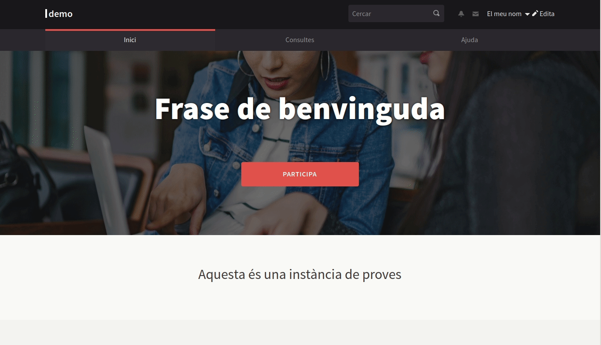
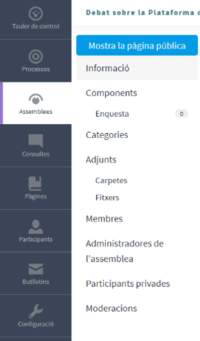
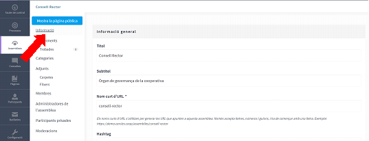
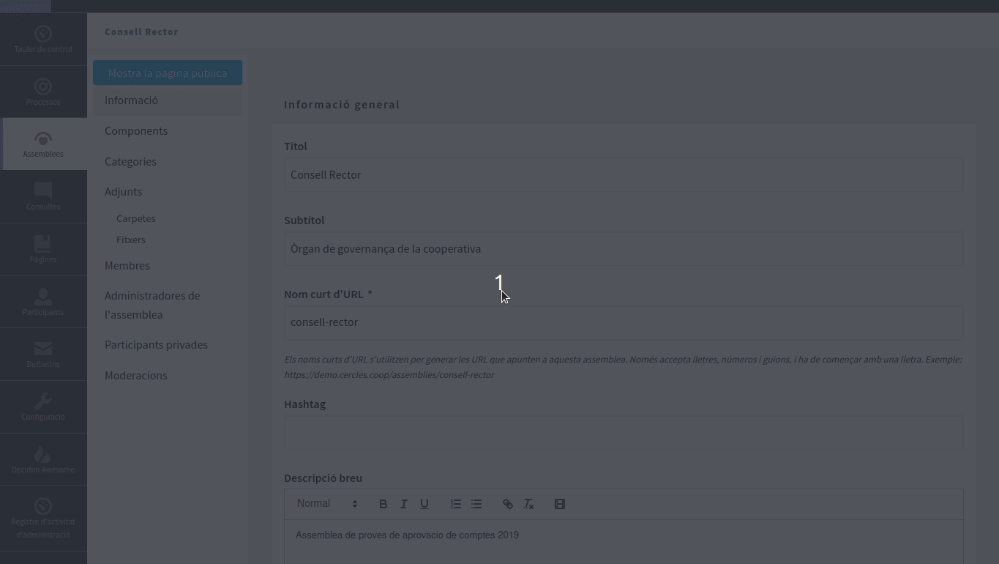
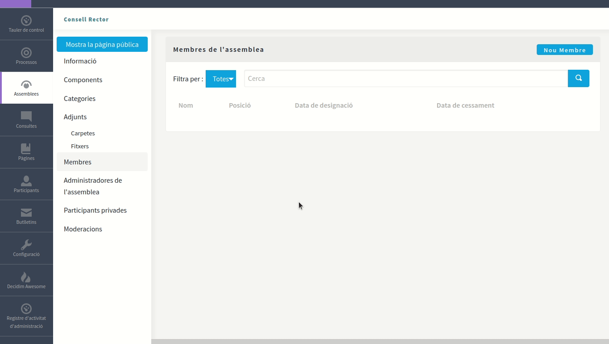
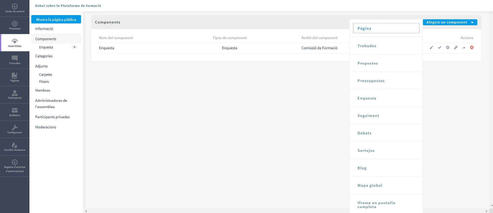
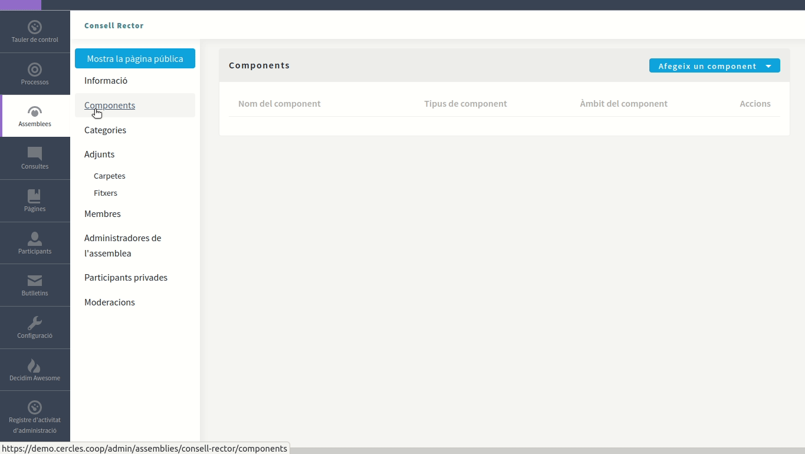
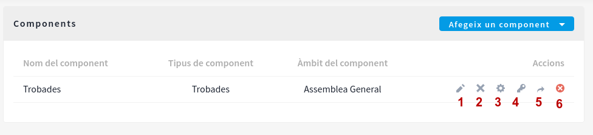

# 5. Guia per crear espais o àmbits de participació societària

**Guia per a la posada en marxa de la instància pròpia a Cercles.Coop. Generar i configurar espais de participació societària i de gestió de les cooperatives**

Anteriorment, a la [Guia de configuració bàsica de la Plataforma de votació](https://guia.cercles.coop/index-de-continguts-de-cercles.coop/guia-basica-plataforma) s'ha descrit els diversos tipus de mòduls que permeten generar, configurar i gestionar espais de participació. A continuació, es descriuen més àmpliament i s'han inclòs exemples pràctiques per facilitar la comprensió de les funcionalitats.

## TIPUS D'ESPAIS O ÀMBITS DE PARTICIPACIÓ

### Processos

A través d’aquest mòdul es poden crear i editar espais de participació definint canals de comunicació, normes de funcionament i ritmes de participació. Com per exemple: demanar a la nostra base social que col·labori a definir o prioritzar alguns aspectes de la política de la cooperativa. 

Els Processos Participatius són, doncs, un dels tipus d’espais de participació que funcionen com a crida puntual i on es defineixen els canals, les normes i els ritmes de participació. Tenen diferents fases temporals que mostren una data d’inici i de fi, per tal que les persones membres de la cooperativa tinguin clar en quin moment del Procés es troben i quant temps durarà cadascuna de les fases. Els Processos estan compostos per una seqüència d’activitats participatives que permeten debatre i prendre una decisió sobre un tema específic. Són útils per a articular debats prolongats en el temps que tenen diferents moments.

Els Processos Participatius poden tenir diferents Components. Cada fase tindrà els seus components segons el que calgui: debatre, proposar o decidir. També existeix l’opció de crear **Grups de Processos** , és a dir agrupar una sèrie de Processos Participatius sota un mateix paraigües. Això és útil per si, per exemple, a part d’un Pla de Gestió es volen debatre un Pla Estratègic i un Reglament de Règim Intern al mateix temps.

| Exemple pràctic: Procés d’elaboració i aprovació del Pla de Gestió anual |
| ------------- |
| ***El Consell Rector  vol elaborar el Pla de Gestió Anual que s’ha de debatre i aprovar entre totes les persones membres. Aquest procés de debat tindrà diferents fases.*** |
| Es crea un “Nou Procés Participatiu” anomenat Pla de Gestió 2021. En crear-lo es configuren les cinc fases que l’integren. Es poden crear els diferents Components que caldrà activar durant el Procés Participatiu. Un cop creats els Components es poden publicar o mantenir creats però només visibles per les persones administradores des del taulell d’administració.
**Fase 1 (Elaboració del text):** El Consell Rector vol que les sòcies aportin idees sobre quins son els eixos de treball que hauria d’incloure el Pla. S’habilita un Component de “Debats” on tothom pot fer aportacions que el CR tindrà en compte a l’hora d’elaborar el text.
**Fase 2 (Debat i esmenes):** Es publica el text del Pla de Gestió elaborat pel Consell Rector a través del Component “Propostes” amb “Textos Participatius” . D’aquesta manera queda el text publicat segmentat per articles i s’habiliten comentaris i esmenes al text que poden fer totes les membres (poden ser perfils personals o de col·lectius).
**Fase 3 (Aprovació esmenes):** El Consell Rector discutirà quines esmenes accepta o no. Les administradores, des del taulell d’administració, podran acceptar o rebutjar les esmenes.
**Fase 4 (Votació del Pla de Gestió):** Amb les esmenes aprovades es publica el text definitiu per portar-lo a votació. S’habilita una “Consulta” per aprovar o no el text definitiu del Pla. La votació serà electrònica, podran votar les persones membres. Es permet votar durant una setmana.
**Fase 5 (Publicació i seguiment de Resultats):** El Pla de Gestió aprovat pel Consell Rector, s’elevarà a l’Assemblea General i quan s’escaigui es publica a Cercles.Coop. Aquest Pla implicarà uns objectius a complir al llarg del any. Creant un Component de “Seguiment de Resultats” es pot fer un seguiment de l’evolució en l’assoliment dels objectius plantejats.|
 
 
 
 ### Assemblees
 
 
 
No confondre aquest mòdul Assemblees amb el d’emissió de vot electrònic que permet el desenvolupament de les Assemblees Generals de Cooperatives i altres reunions societàries que requereixin vot. El mòdul que permet celebrar reunions societàries que requereixen emissió de vot electrònic és el de **CONSULTES**.

 
 
 El mòdul Assemblees és el mecanisme dins de Cercles.Coop que ens permet mostrar i gestionar espais de participació estables de la nostra cooperativa. Els podem fer servir per dinamitzar grups de treball, estructurar processos estratègics o bé vehicular la participació dels òrgans societaris. Per tant, aquest mòdul, com a espai de participació, ve a ser un grup de sòcies de la cooperativa que es reuneixen amb certa periodicitat per debatre i prendre decisions sobre determinats temes.
 
Una Assemblea es pot utilitzar per publicar les reunions i acords d’un òrgans societari o de gestió de la Cooperatives perquè totes les sòcies en puguin fer un seguiment i puguin, si escau, aportar idees o propostes. Una altra possible utilitat d’una Assemblea és que serveixi com a espai de treball intern pels membres de la comissió, on poden penjar-hi documents, imatges, crear propostes col·laboratives, penjar l’ordre del dia de les reunions, etc.

La darrera utilitat que pot tenir una Assemblea és la d’articular i ser un espai de suport digital d’una Assemblea General de cooperatives. 

Així doncs la utilitat que se li pot donar és variada segons les necessitats concretes de la cooperativa, els espais d’Assemblea són modelables i es poden adaptar a cada cas. Es poden tenir diferents Assemblees actives alhora, conformant així la xarxa organitzativa de la cooperativa. Es poden incloure diverses Assemblees (filles) dins d’una Assemblea (mare).

| **Exemple Pràctic 1: Seguiment del treball d’una Comissió** |
| ------------- | 
| ***El Consell Rector, altres òrgans societaris i les comissions de gestió (comunicació, relacions institucionals, qualitat...) tant sectorials com territorials, volen habilitar un espai en el que puguin anar penjant la documentació que generen, els dies i llocs de les seves reunions i habilitar un espai de debat per a que els membre puguin aportar idees sobre campanyes comunicatives, nous projectes, o altres qüestions.*** | 
| Es crea una nova Assemblea (mare) anomenada Òrgans Societaris que inclou a dins quatre assemblees (filles): Consell Rector, Consell Social, Assemblees preparatòries i Comitè de participació. En aquestes assemblees cada àrea societària o de treball penja de forma pública i accessible per totes les membres de l’àrea els diferents documents que genera i recursos necessaris per a desenvolupar l’activitat. També pot obrir la documentació perquè sigui pública per a totes les sòcies i permetre que aquestes o sòcies que formen part d’altres àrees també puguin fer propostes.
El Consell Social mitjançant l’apartat “Adjunts” i “Carpetes” penja un document sobre una modificació de Reglament de Règim Intern que aplicaria al col·lectiu de sòcies consumidores. D’aquesta manera les sòcies membres del Consell Social de cada localitat, divisió... poden accedir a tot aquest material.
El comitè de participació vol fer una sèrie de reunions informatives per tot el territori per poder explicar l’aprovació d’una nova modificació estatutària de la cooperativa. Per fer-ho activa un Component “Trobades” dins de la seva Assemblea, on podrà programar dia, hora i lloc de les diferents reunions informatives. Es podran habilitar les inscripcions per fer un càlcul d’assistència. Les sòcies podran veure les convocatòries de les reunions, l’ordre del dia i els documents adjunts a aquella reunió. | 

| **Exemple pràctic 2: Espais privats de treball intern per les Comissions** |
| ------------- |
| **Les Comissions o sectorials volen tenir un espai intern de treball, on poder compartir documents, elaborar textos col·lectivament, tenir debats i comunicar-se.** |
|Caldria crear noves Assemblees o bé configurar les Assemblees ja creades en l’exemple anterior. En la configuració general caldria que es marquessin com a “Privades” per restingir l’accés a les sòcies que formen part de les comissions, o bé com a “Privades transparents” si es vol que les persones que no tingui els “Permisos” puguin veure els continguts que es pengen però no puguin editar. Les “Participants Privades” d’una Assemblea privada es poden pujar manualment des del taulell d’administració.|

| **Exemple pràctic 3: Assemblea General Ordinària** |
| ------------- |
| ***Anualment la cooperativa celebra la seva Assemblea General Ordinària, on es debaten i voten una sèrie de punts i documents que marquen les línies de treball, la gestió efectuada... enguany també hi ha renovació de Consell Rector.*** |
| Es crea una nova Assemblea amb el nom AGO 2021. En aquesta Assemblea s’activaran diferents Components per a poder realitzar el debat dels documents, la confirmació d’assistència i la presentació de candidatures pel nou Consell Rector, tal i com marqui els estatuts, (hi ha més opcions en una Assemblea, aquí donem només alguns exemples).
Debat dels documents: Hi ha diferents opcions segons quin sigui el procediment de debat i aprovació que estableixi la cooperativa, això és tan sols un exemple de com fer-ho: Es publica el text que proposa el Consell Rector a través del Component “Propostes” amb “Textos Participatius” . D’aquesta manera queda el text publicat segmentat per articles i s’habiliten comentaris i esmenes al text que poden fer totes les sòcies (poden ser perfils personals o de col·lectius). Al Cercles.Coop queden recollides totes les esmenes, i després presencialment es discuteixen i voten a l’AGO.
Candidatures de Consell Rector: S’habilita un Component de “ Propostes ” amb el nom de Candidatures CR en el que es permet que cada sòcia pugui pujar una proposta de candidatura, segons regulin els estatuts socials i, si escau, el reglament electoral. S’estableix un període de temps límit per presentar-se i un cop recollides totes les candidatures es podria votar a través del Cercles.Coop (mòdul Consultes de vot electrònic durant la celebració de l’AGO).
Informació i control d’assistència: Mitjançant un Component de “Trobades” es pot crear una pestanya dins de l’Assemblea on aparegui la data, la hora, el lloc (amb un localització marcada en un mapa). Tanmateix es poden adjuntar arxius i crear un ordre del dia. Existeix també la possibilitat d’habilitar “Inscripcions” que permet controlar quantes persones confirmen assistència.|

### Consultes

El mòdul Consultes és el mecanisme que ens ofereix Cercles.Coop per vehicular les votacions electròniques a preguntes concretes. És a partir d’on organitzem les votacions a les d’Assemblees Generals o altres reunions societàries i on recollim els vots electrònics amb les garanties necessàries. 

Consulta [aquí](https://guia.cercles.coop/index-de-continguts-de-cercles.coop/posada-en-marxa) la guia específica on es detalla com configurar una reunió societària virtual que requereixi emissió de vot electrònic. 

## COM CREAR UNA ASSEMBLEA

Cercles.Coop  ofereix la possibilitat de crear i gestionar espais de participació estables en el temps a través del mòdul **Assemblees**. 


És important no confondre el terme Assemblees del Cercles.Coop amb el concepte Assemblees, com a òrgan societari d’una cooperativa i, per tant, amb el mòdul de Consultes. Es farà servir el mòdul consultes per celebrar reunions societàries que requereixen vot electrònic, com les Assemblees Generals.


Com s’ha descrit anteriorment, les **Assemblees** són els espais de trobada, debat i presa de decisió regulars en el temps, ens serveixen per gestionar els òrgans societaris i de gestió de la cooperativa. 

Quan accedim a Assemblees ens apareix un menú específic amb les opcions següents: **Assemblees, Tipus d’assemblees i Configuració**. Vegem a continuació perquè serveix cada opció:

***Tipus d’assemblees:*** Aquest apartat de submenú, ens permet detallar la tipologia d’espais de participació, poden ser tant òrgans societaris com de gestió de la cooperativa. Com per exemple: Consell Rector, Consell Social, Comissió de comunicació, Àrea de Qualitat, Àrea de projectes...

***Configuració:*** es pot habilitar l’organigrama; aquesta funció relaciona i mostra, de manera automàtica, en un núvol d’etiquetes la interrelació que es produeix entre els diferents espais de participació i els òrgans de què depenen. La interrelació es configura quan generem un espai de participació. Més endavant s’explica de quin apartat depèn i es recull la informació que es postrarà a l’organigrama.

***Assemblea:*** opció del menú que ens permet crear l’espai o àmbit de participació des del tauler d’administració.

Accedint a **Assemblees > Nova assemblea**, s’obre el formulari de creació on cal introduir tota la informació necessària la qual està organitzada en diferents seccions. Alhora, podreu observar que apareix, al lateral esquerre, un submenú a través del qual podrem anar definint els components i característiques de l’espai de participació que creem. Els camps obligatoris són els marcats amb un asterisc i no es poden deixar en blanc. Són els següents:

* Títol i subtítol
* El Nom curt d'URL, és a dir, el fragment final de l'adreça web que tindrà aquest espai. Ha de ser una sola paraula, pot contenir números, però no pot tenir espais. Si es vol posar més d'una paraula, cal separar-les amb un guionet mig.
*	La Descripció breu, que apareixerà a la pàgina general on es llisten els òrgans.
*	La Descripció completa, que serà la pàgina general d'informació d'aquest òrgan.

La resta de camps estan pensats per donar informació complementària a la pàgina d'informació de l’espai concret. Ompliu-los sempre que donin alguna informació rellevant a la base social, com la **organització interna**, el **propòsit** de l'òrgan o quina **composició de membres** té l’espai. 

Al crear una Assemblea aquesta es manté despublicada. Tota la feina que es faci no serà visible fins que no cliqueu el botó **Publicar** situat al final de la pàgina. 

Repasseu tota la informació que es pot introduir en aquesta pàgina i quan arribeu a la secció **Filtres** pareu atenció perquè si completeu la informació d’aquest espai, permetrà determinar els àmbits i àrees de treball que apareixeran com a núvol d’etiquetes a l’organigrama.  A més, en aquest formulari també hi ha la secció de **Visibilitat** que a continuació s’explica amb més detall.

Un cop anem creant els diversos espais de participació dins el mòdul Assemblea, aquests ens apareixen llistats en pantalla i quan entrem dins d’un concret, bé clicant el títol de l’espai  o premem la icona llapis, es genera un submenú d’opcions que permeten anar configurant les diverses accions que desenvoluparem dins l’espai de participació: debats, trobades, enquestes, qui és membre o participant de l’espai, documentació associada... tal i com es mostra a la imatge següent:

### La privacitat dels espais de participació

En la secció de **Visibilitat** es poden configurar diferents característiques sobre com es veurà l’espai creat.

L’opció **Assemblea principal** obre un desplegable i ens permet vincular, si escau, un espai participatiu amb un altre. És la manera en què podem definir la jerarquia entre els diferents espais de la nostra organització.

Podem definir també que aquest sigui un espai **destacat**. Si el marquem així, aquest apareixerà en un lloc més visible, tant a la portada de Cercles.Coop  com al llistat d’espais de participació.

En aquesta secció també es pot definir el **tipus de privacitat** que tindrà l’espai. Per defecte, tot el que publiquem a Cercles.Coop serà visible per a tothom, i si no fem una configuració específica, totes les sòcies i no sòcies habilitades amb una compta podran comentar, fer propostes, apuntar-se a les reunions... I potser, en tots els casos, no volem que sigui així.

Si es marca l’opció **Espai privat** estem fent que només les persones que nosaltres invitem específicament podran veure i participar d’aquest espai. Aquesta opció servirà per segmentar les sòcies, i també no sòcies, en els corresponents espais de participació.

Si volem treballar amb un grup segmentat, però que alhora tota la resta de persones puguin consultar els fruits del nostre treball, marcarem també la opció **És transparent**. Fixeu-vos que aquesta opció només s’activa en espais privats i precisament el que fa és fer visible tot el treball fet en un grup privat, sense poder-hi participar sinó rebem una invitació a tal efecte.


Si estem pensant en crear un espai per a publicar la feina, per exemple, del **Consell Rector** segurament ens interessarà la configuració **Privat i transparent**, ja que només els membres del Consell podran interactuar en aquest espai, però mantenint la seva feina visible per a totes les persones sòcies.


Així doncs, caldrà acabar de completar la informació necessària per generar un espai de participació i per desar els canvis cal clicar el botó **Actualitza**. 

Recordeu que en tot moment es pot tornar a modificar i completar aquesta informació clicant a l’apartat **Informació** del menú d’administració de l’espai o òrgan de participació que hem generat, tal i com es mostra a la imatge següent.

### Organització de la participació

Un cop tenim l’espai de participació creat, i abans de programar o definir altres aspectes del mateix, cal que configurem qui podrà interactuar en aquest grup de treball específic que hem creat.

Fixeu-vos en el submenú d’administració de l’espai, a l’àrea lateral esquerra. Veureu tres apartats que fan referència a les persones que poden interactuar en aquest espai: **Membres, Administradores de l’assemblea i Participants privades**. Comencem analitzant aquest últim apartat.

**Participants privades**
Són totes aquelles persones que estan cridades a participar en aquest espai. Per tant, estem parlant d’un grup concret de sòcies i/o no sòcies que incorporarem en funció del tipus d’espai de participació que estiguem generant. 

Quan s’accedeix a aquest apartat veureu que és buit, ja que encara no s’ha afegit els membres participants. Tenim dos mecanismes per fer-ho:

* Important un arxiu CSV amb les dades de les persones que formen part d’aquest grup o espai de participació concret. Ho farem a través del botó **Importar via csv**, que trobem a la part superior dreta.
* Clicant al botó **Nou participant d’espai de participació privat**, que trobem a la part superior dreta, i que obre el formulari per afegir participants. Aquest està compost per dos camps: El nom de la persona participant i el seu correu electrònic. A l’omplir-lo, si la persona no ha estat donada d’alta anteriorment, rebrà un correu electrònic amb un enllaç d’invitació a aquest espai. Si la persona [ja era usuària](https://guia.cercles.coop/index-de-continguts-de-cercles.coop/guia-basica-plataforma#participants), s’afegeix directament.

A mesura que anem afegint nous participants, aquests aniran apareixent llistats en aquest apartat. Aquesta llista ens mostra les dades que hem introduït (nom i correu electrònic) així com la data en que hem invitat la persona a participar i la data en que aquesta persona ha acceptat, si ho ha fet. Si no ha acceptat la invitació, podrem tornar a enviar el correu electrònic perquè s’enregistri a la instància de Cercles.Coop.

En tot moment podrem donar de baixa a una persona d’aquest espai, clicant sobre la icona d’aspa vermella que trobareu a la dreta del llistat.


Recordeu que, tot i que sou administradors, quan navegueu per la part pública sou una participant més. Si voleu participar dels debats o inscriure’us a les trobades també haureu d’invitar-vos a aquest espai com a la resta d’usuaris!


Les persones que hem afegit com a participants privades poden interactuar lliurement en la part pública de l’espai creat: comentar, fer propostes, inscriure’s a les trobades...

### Administradores de l’assemblea

Pot ser que en alguns casos vulguem assignar a algunes persones un rol especial, perquè ens puguin ajudar amb algunes tasques de gestió del nostre espai de participació. Si és el cas, les haurem d’afegir com a Administradores de l’assemblea.

El mecanisme per afegir-les és molt similar al d’afegir participants. Ens adrecem a la secció Administradores de l’assemblea i clicarem al botó Nou Administradora de l’assemblea.

En aquest formulari podreu introduir les dades de la persona que es vol afegir: el seu nom i el seu correu electrònic, assignant-li també el paper que volem que tingui en la gestió de l’espai:
* Avaluadora.
* Moderadora
* Col·laboradora
* Administradora

Les **persones avaluadores** són aquelles que poden accedir a l’apartat d’administració per avaluar les propostes que nosaltres li haguem assignat prèviament. Caldrà que seleccionem les propostes i les assignem a una persona referent i aquesta podrà valorar la proposta: acceptant-la, rebutjant-la o deixant-la en avaluació.

Les persones amb el rol de **moderadora** poden avaluar totes les propostes, sense necessitat de que les haguem d’assignar prèviament. També, si algun usuari de la plataforma denuncia alguna publicació per contenir contingut inapropiat, les persones moderadores poden avaluar-lo i retirar-lo, si es creu convenient.

Les persones amb rol de **col·laboradora** poden, a més de les accions de valoració que realitzen les avaluadores i les moderadores, afegir i gestionar el contingut de tots els apartats del nostre espai de participació. No podran en cap cas, alterar-ne la configuració.

I les persones amb rol d’**administradora** tenen accés total a l’administració d’aquest espai. Poden afegir nous components, canviar el comportament dels existents... també poden accedir a l’apartat d’enviament de butlletins de la plataforma. Això si, només podran fer enviaments a les persones participants o seguidores de l’espai de participació del que en son responsables.

Aquests rols tenen capacitat d’executar tasques d’administració i gestió de l’espai, assignem-los amb responsabilitat.

### Els membres de l’espai de participació

Finalment, hi ha una última secció on podem treballar amb les participants del nostre espai.

Fins ara hem anat atorgant drets sobre el nostre espai a diferents persones: qui pot participar, qui pot gestionar-lo... però aquests rols no són visibles per a les sòcies, només hi podem accedir des de l’apartat d’administració.

Si per política de transparència de la cooperativa voldrem publicar un llistat de les persones que formen part del nostre espai de treball, i oferir una via de contacte directe, Cercles.Coop  ens ofereix una manera específica per fer-ho. Adreceu-vos a l’apartat **Membres** del menú d’administració de l’**Assemblea**. Allà veureu el botó **Nou membre** que servirà per afegir nous membres a l’espai de participació.

Fixeu-vos que aquest formulari us demana moltes més dades que en els casos anteriors.

Primer de tot, haurem d’indicar si la persona que volem afegir com a membre és ja un participant de Cercles.Coop o no.

Si hem indicat que és un participant existent, haurem d’indicar quin és el seu nom d’usuari. Si en canvi és una persona que no tenim enregistrada, haurem d’introduir el seu nom complet.

Els participants que incorporem a través d’aquesta opció, habitualment seran les persones no sòcies però vinculades a la cooperativa i amb qui necessitem establir espais de participació i també les persones sòcies que no participen directament en òrgans societaris, com seria el cas, per exemple, dels socis que participen a través de delegats.


Recomanem que els membres del nostre espai o òrgan de participació siguin usuaris existents, ja que ofereix la possibilitat de contactar amb aquests a través de la pròpia plataforma.


Caldrà indicar obligatòriament altres qüestions com: quin paper té en el nostre espai de participació (Presidència, vicepresidència, secretaria...) o la data de la seva inclusió en aquest espai. Les altres informacions són complementàries.

Fixeu-vos en el camp **Pes** (potser el veuràs en anglès). Aquest camp ens permet definir l’ordre en que apareixeran les persones en la pàgina de membres. Si no indiquem cap ordre específic, aquestes s'ordenaran segons l’ordre pel qual les has anat introduint.

Adreceu-vos a la pàgina pública de l’espai o òrgan creat, veureu que s’ha creat la pestanya Membres en el menú d’aquest espai. Allà veureu les dades de les persones membres.

Tal i com haureu observat al submenú que es genera quan estem dins d’un espai o òrgan de participació concret, hi ha més opcions a banda de la gestió dels participants. Aquestes opcions són: **Components, Categories i Adjunts.**

Si entrem dins l’opció de **components**, per defecte no en trobarem cap de generat. Per crear-ne un clicarem el botó blau de la part superior que diu **Afegeix un component**. A continuació, veureu que s’obre un desplegable que permet incorporar diverses accions, tal i com es mostra a la imatge següent:

## COMPONENTS

Els Components son els diferents mecanismes de participació que es poden habilitar als Espais o Àmbits de Participació dels mòduls, tant a Processos com a Assemblees, i cadascun d’ells permet participar d’una manera determinada.

### Pàgina

Aquest component permet genera un apartat explicatiu i descriptiu de totes les accions i  fases que prevegi l’espai de participació que hem creat: com participar, qui forma part d’aquest espai de participació, quin pla de treball té aquest espai de participació... Serveix perquè el soci com a usuari conegui que fa aquest espai i , si s’escau, saber com participar-hi. 

Per afegir una pàgina, clicar **Pàgina** en el desplegable **Afegir Component**. S’han d’omplir els següents camps:

* Nom: nom de la pàgina.
* Pes: Correspon a l’ordre en què els components (en aquest cas la pàgina) es mostren en el menú d’usuari. Si el deixem a zero els elements s'ordenen seguint l'ordre de creació.
* A Configuració global: si es vol mostrar un Avís a la Pàgina (missatge destacat), cal escriure el contingut del missatge.
* A Configuració de fase, si es vol mostrar un Avís en la Pàgina (missatge destacat) durant l’execució d’una fase, escriure el contingut del missatge en la fase a la qual hauria de sortir.

A continuació, clicar **Afegir component**.

Per crear i editar els continguts de la Pàgina creada, en el submenú de l’esquerra del procés de participació, a Components, clicar sobre el nom de la pàgina que hem creat. S’obre la finestra **Editar pàgina**. Dins del quadre **Cos**, escriure el contingut de la pàgina. Un cop fet, cal clicar **Actualitzar** per desar els canvis. També es pot editar la pàgina o canviar la seva configuració des de la finestra Components, clicant les **icones corresponents** (Gestionar i Configurar). Així mateix, des d’aquesta finestra es pot Publicar, Despublicar o Eliminar la pàgina. 

### Trobades

Cercles.Coop  facilita espais on la participació sigui híbrida, és a dir, que les persones que no poden participar en una convocatòria presencial també pugui dir la seva en un espai en línia. Amb aquest objectiu, el component de **Trobades** ens ofereix molt més que la gestió de convocatòries. Ens permet alternar la presencialitat i la virtualitat o una d’aquestes opcions.

Quan generem una **Trobada** haurem de repassar les opcions de configuració que se’ns demana. Recordeu que primer haurem de definir el comportament global i desprès detallar-ne el comportament per cada una de les fases del nostre procés.

Fixa-vos en el camp **Pes**. El pes és la manera en què podem ordenar els elements del nostre menú del procés. Si el deixem a zero els elements s'ordenen seguint l'ordre de creació. Si volem alterar aquest ordre, canviem el pes: a pes més alt, l'element es situarà més a la dreta del menú d’usuari.

Repassem l’apartat de la configuració global. El component de **Trobades** ens permet situar un fragment de text destacat a la part superior de la pàgina de trobades, el podem definir a l'apartat **Avís**. 

També ens permet situar un text per a definir els **Termes** de registre per defecte. Si el definim en aquest apartat, no l'haurem d'introduir cada vegada que vulguem fer una inscripció a les nostres trobades.

A continuació podem definir altres característiques de les trobades. Repasseu les opcions existents però tingueu present que les opcions marcades per defecte són les que ens poden servir en la majoria de casos.

Potser us pot interessar marcar l’opció **Les participants poden crear trobades**, de manera que les pròpies persones membres d’aquest òrgan podran crear les convocatòries sense passar pel taulell d’administració.

Un cop creada la Trobada a través de la configuració bàsica aquesta queda llistada a l’apartat **Components** i on podeu previsualitzar els components configurats prement sobre el **Nom del component corresponent** i a la dreta apareixen unes icones que permeten un seguit d’accions, tal i com es mostra a la imatge següent:

1.	Gestionar, a la icona del llapis; per afegir i gestionar les trobades.	
2.	Publicar, a la icona del vist; podeu treballar sobre un component i no fer-lo visible al menú fins que ho decidiu.
3.	Tornar a l’apartat de configuració, a la icona de l'engranatge.
4.	Limitar la participació al cens de sòcies, a la icona de la clau.
5.	Compartir el component (útil quan encara no l’heu fet públic).
6.	Esborrar el component, fent servir la icona de l’aspa vermella.

Quan publiqueu el component, la icona del vist es convertirà en la icona d'una creu, que farà la funció inversa i, per tant, per despublicar. Recordeu que per molt que publiqueu un component, si el procés sencer està despublicat les sòcies no hi tindran accés, ja que només l'estem habilitat dintre del menú de l’àrea d’administració.

Les **trobades** poden ser *Privades*, només les sòcies amb permisos podran visualitzar i interactuar amb aquest, o bé *Privades Transparents*, només poden editar les sòcies participants privades però la trobada és pública i tothom pot veure la informació rela-cionada (seria útil per a reunions d’una comissió). També poden ser totalment públi-ques i obertes a totes les sòcies.

#### Crea convocatòries
Ara començarem a introduir trobades, clicant a la opció **Gestionar** (la icona del llapis).

Clicant a Nova trobada s’obre un formulari amb els camps per crear una convocatòria. Ompliu els camps del formulari, tenint en compte que:

* **Adreça** és el carrer, número i ciutat del lloc on es realitza la trobada, si es tracta d’una convocatòria presencial o bé un enllaç a una plataforma de videoconferència, si es tracta d’una convocatòria virtual.
* **Ubicació** és el nom de l'equipament o lloc. Per exemple: seu social de la Cooperativa o bé el nom de la plataforma de videoconferència que utilitzem.
* **Detalls de la ubicació** ens permetrà especificar indicacions per trobar el lloc de la trobada, com per exemple, Sala d'Actes.

Podem indicar si una trobada és *privada*. Si marquem aquesta opció, només les persones que nosaltres convidem podran veure i apuntar-se a aquesta trobada. Si marquem la opció privada, se'ns habilita la opció *transparent*. Quan fem una trobada privada i transparent, tothom pot veure'n la convocatòria però només podran participar-hi les persones que nosaltres convidem.

Si ja heu indicat que tot l’òrgan o espai de participació és privat i transparent no cal que torneu a configurar-ho a cada convocatòria.

Podeu afegir, a cada trobada, una cartera de **Serveis** (com ludoteca, traducció per sords, servei de cangur, etc.) que oferiu a les sòcies. Aquests serveis actuen a títol informatiu i ocuparan un espai ben visible un cop la trobada estigui publicada.

Omplerta la informació i les dades generals bàsiques, podeu crear la vostra primera trobada clicant el botó **Crea** situat al final de la pàgina.

Un cop creada, podreu realitzar un seguit d'accions relacionades amb aquesta. Les repassem ràpidament, seguint ordre d'esquerra – dreta, més endavant veurem amb detall les que puguin ser més interessants.

*	**Previsualitzar**, la icona del ull – ens permet veure com es visualitzarà la informació introduïda a la part d’usuari sense haver publicat el component.
* **Duplicar**, a la icona del porta-retalls. Ens permet realitzar una còpia d'una trobada. Molt útil si hem de realitzar trobades de manera recurrent. Recordeu canviar la data de la de la nova trobada!
* **Editar**, la icona del llapis. Per modificar la informació introduïda o afegir nous serveis.
* **Inscripcions**, la icona de les dues persones. Per habilitat i gestionar el registre a la trobada.
* La icona del rellotge ens permetrà publicar l'**acta** de la trobada, ja sigui en format text, vídeo o àudio.
* La icona de l'agenda ens permet elaborar i publicar un **ordre del dia** de la sessió.
* L'acció **tancar**, a la icona del cadenat, ens permet realitzar un tancament tècnic de la trobada, introduint una valoració qualitativa, l'informe, com una valoració més quantitativa, recontant les persones participants. En el cas que s'hagin produït propostes, podem vincular-les també aquí.
* Les dues següents accions ens permeten adjuntar documentació a una trobada. Podem publicar documentació fent servir la icona del **clip**. En el cas que tinguem molta documentació per compartir, podem organitzar-la fent servir les carpetes.
* Si hem activat la opció de **permetre establir permisos d'accions** per cada trobada, veurem la icona de la clau, i limitant les inscripcions a les trobades a les persones in-corporades a través del [cens de socis](https://guia.cercles.coop/index-de-continguts-de-cercles.coop/posada-en-marxa#importacio-del-cens-virtual-de-socis) i establint diversos graus de verificació i au-tentificació de persones: per verificació directa (registre per correu electrònic) i  per **Codi per SMS**.
* I finalment, la creu vermella ens permetrà eliminar una trobada.

#### Inscripcions

Per a convocatòries públiques ens pot interessar crear un registre d’**inscripcions**. Si és així, adreceu-vos a la icona de les dues persones, a dreta de  la trobada creada. S'obrirà una nova finestra.
Primer, haureu d'activar la casella Inscripcions obertes i podreu definir els elements bàsics de la trobada:

* Espais disponibles per aquesta trobada, és a dir, quantes persones com a màxim podran assistir.
* Amb la opció següent, podeu determinar de la capacitat de l’espai indicada anteriorment, quantes places voleu reservar (places que sabeu que estaran ocupades per a persones que no cal que facin el registre).

Si al configurar el component **Trobades** heu definit el text de **Termes de registre**, ja no serà necessari que ho torneu a introduir, tot i que podreu modificar-lo si és necessari, afegint, per exemple, una clàusula específica o si tens previst treballar amb un col·lectiu especialment protegit per la Regulació General de Protecció de Dades.

Deseu aquesta primera configuració i ja tindreu habilitades les inscripcions: Comproveu-ho clicant a l'acció de **Previsualització**.

D'aquesta manera, es podrà inscriure a la nostra convocatòria qualsevol persona que tinguem enregistrada al Cercles.Coop. Al clicar sobre el botó **Inscriu-te a la trobada**, qui estigui fent la inscripció rebrà a la seva adreça electrònica un correu amb un codi de registre a la trobada.

Podrem descarregar un llistat de persones inscrites, obrint de nou l’apartat de gestió d'inscripcions. Fixeu-vos que a la part superior dreta hi ha un botó amb la opció **Exporta**, on podreu descarregar el llistat de persones inscrites. Aquest llistat té, per defecte, el codi de registre que han rebut els inscrits per correu electrònic, el seu nom d'usuari i el seu correu electrònic.

És possible que necessiteu recollir més dades en les inscripcions. En aquesta mateixa pàgina trobareu el botó **Formularis d'inscripció**, si el cliqueu podreu crear un formulari amb les preguntes específiques que vulgueu incloure. Si heu fet servir el component Enquestes abans, veureu que el seu funcionament és molt similar.

Un cop hagueu creat les diferents preguntes, premeu **Desa** el formulari i recordeu activar-lo a la pàgina principal de les inscripcions, marcant la casella **Formulari d'inscripcions habilitat**.

Com veureu, també hi ha un botó que diu **Invitacions**. Amb aquesta opció podeu convidar directament a persones que considereu incorporant el seu nom i adreça electrònica.

#### Al finalitzar la trobada

Un cop realitzada una trobada, és una bona pràctica donar-hi tancament. Fixeu-vos amb la icona d'acció **Tancar**, representada per un cadenat. En aquest apartat podreu realitzar un breu Informe de la sessió, així com llistar les persones que han participat i indicar el nombre d'assistents.

Si heu començat a treballar propostes, podeu indicar també el nombre de contribucions que s'han fet i vincular aquí les propostes realitzades.

És recomanable eliminar les dades personals que hem extret de les inscripcions a les trobades en el moment que tanquem la Trobada. En tot cas, les dades personals recollides a efectes de gestió de Trobades, s’han de destruir o eliminar en un període màxim de 3 mesos. 

| **Exemple pràctic 1: Assemblees preparatòries** |
| ------------- |
| Cada any el Consell Rector de la cooperativa, d’acord amb el que regulen els propis estatuts socials, desenvolupa Assemblees preparatòries o de secció arreu del territori on té sòcies desplegades. En concret, s’organitzaran assemblees preparatòries a Reus, Móra d’Ebre, Igualada, Olot, Mataró i Cassà de la Selva.
Aquestes Assemblees preparatòries (component Trobades) serveixen per preparar l’Assemblea General, designar els socis delegats que representaran a les sòcies del territori a l’Assemblea General, entre d’altres assumptes societaris.
Dins Cercles.Coop, al mòdul Assemblea, tenim una assemblea mare creada que té per nom Òrgans Societaris i una de les assemblees filles és la d’Assemblees preparatòries. Es crea un component Trobades que porta el nom de Assemblees Preparatòries 2021. Al crear-la es poden establir algunes configuracions que afectaran a totes les Trobades que s’incloguin dins d’Assemblees Preparatòries 2021. Es poden habilitar els comentaris, la creació de pads col·laboratius i establir permisos (qui pot editar informació). Un cop configurat es creen i publiquen les 6 reunions informatives que es faran al llarg de, per exemple, dos mesos. Això es fa a través de “Nova Trobada” , on es poden fer les següents configuracions:
* Data i lloc: Al crear la Trobada cal establir una data i un lloc concret on es realitzarà. El lloc pot ser un espai físic presencial com un enllaç a videoconferència per fer la trobada virtual, també pot ser híbrida. Al introduir l’adreça, el Cercles.Coop busca les coordenades i es publicarà un mapa interactiu on poder veure la ubicació de la Trobada.
* Inscripcions: Quan es configura la Trobada es pot habilitar l’opció “Inscripcions Obertes” que permet establir un nombre màxim de persones que poden assistir i si s’escau un formulari d’inscripció. D’aquesta manera es pot preveure l’assistència que hi haurà a una reunió.
* Acta i ordre del dia: Cercles.Coop permet crear un Ordre del dia amb apartats i subapartats, i una explicació per a cadascun d’ells si és convenient. Un cop s’ha realitzat la reunió permet penjar l’acta per a que tothom pugui conèixer que s’ha parlat en la trobada.
* Documents: En la configuració de cada Trobada es poden crear “Adjunts” per penjar-hi arxius importants per a la reunió que es poden agrupar en “Carpetes” .|

### Propostes

Les Propostes son l’eina a través de la qual poder recollir propostes escrites de les sòcies. Aquest és un Component molt versàtil que té diverses utilitats i funcions. Pot servir per debatre sobre un text base i fer-hi esmenes utilitzant els “Textos participatius ”. Una altra possibilitat és usar-ho per a presentar i votar candidatures de persones que volen formar part d’una comissió o del Consell Rector. Tanmateix, hi ha l’opció de fer servir l’eina de Propostes per recollir idees sobre com fer un determinat projecte o activitat i després votar la millor proposta.

Existeixen diferents opcions per fer les propostes:
* Textos participatius: Es penja un document base fragmentat per articles sobre el que es poden fer comentaris i esmenes a parts concretes del text.
* Propostes oficials: El perfil “oficial” de la cooperativa és qui emet les propostes, les sòcies poden comentar-les i si s’escau votar-les
* Propostes d’usuàries: Les sòcies poden afegir “Noves Propostes” seguint el formulari prèviament configurat. Poden conviure propostes oficials i de sòcies en un mateix Component de Propostes.

Per configurar el component **Propostes**, en el submenú de Processos o Assemblees, clicar Components, a continuació clicar Afegir Component a la part superior dreta de la finestra i seleccionar Propostes. 

La informació que cal escriure quan es configura la funcionalitat propostes és:

* Nom
* Pes: l’ordre en què s’ha de mostrar el component Propostes en el menú del procés participatiu.
* Configuració global:
 * Límit de vot: Seleccionar, si s’escau, el límit de suports que pot donar un usuari.
 * Marcar les opcions que es desitja activar per la configuració general del component Propostes: Resposta oficial a propostes activades, Propostes oficials habilitades, Comentaris habilitats, Geocodificació habilitada, Permetre arxius adjunts.
 * Avís: escriure si es vol mostrar un avís quan el soci estigui realitzant una proposta.
 * Text d'ajuda al crear una nova proposta: escriure si es vol mostrar.
* Configuració de fase:
 * Marcar les opcions que es volen activar per a cadascuna de les fases: Suports habilitats, Suports bloquejats, Vots ocults (si els vots estan habilitats, marcant aquesta opció s’amaga el nombre de vots), Comentaris bloquejats, Habilitar de creació de propostes, Resposta oficial a propostes activades.
 * Avís: escriure si es desitja mostrar un avís quan el soci estigui realitzant una proposta.

Per acabar, clicar **Afegir component**.

Per a la gestió de les propostes, és a dir acceptar o rebutjar les propostes que han fet els participants durant el procés, clicar Propostes en el submenú del procés. S’obre la finestra Propostes, on hi ha el llistat amb totes les propostes i per a cadascuna una sèrie d’informació (Títol, Categoria, Àmbit, Estat, és a dir si està Acceptada, Rebutjada, No resposta), i les possibles Accions (Respondre i Previsualitzar).

Per respondre les propostes, clicar la icona Resposta, s’obre la finestra Respondre a la Proposta, en què s’ha de marcar Acceptada o Rebutjada i escriure el motiu o la resposta que es vol donar en el quadre Resposta.

També es poden exportar les propostes i/o els comentaris en els formats CSV o JSON,  clicant Exporta en la part superior dreta.

Per crear una nova proposta, és a dir, fer propostes oficials, clicar Nova a la part superior dreta de la finestra Propostes, s’obre la finestra Crear Proposta, en la que cal posar: Títol, Cos (descripció) i seleccionar si s’escau la Categoria en el desplegable. A continuació clicar **Crear**.

| **Exemple Pràctic 1: Debat i esmenes del Pla de Gestió (Textos Participatius)** |
| ------------- |
| Reprenem l’exemple del Procés Participatiu per elaborar un Pla de Gestió, que en les fases 2 i 3 requeria del Component Propostes. En la Fase 2 estava previst el debat i esmenes del text i en la Fase 3 l’aprovació de les esmenes. El Consell Rector ja ha elaborat el text base de la proposta de Pla de Gestió, el posarà a disposició de totes les sòcies per a que puguin llegir-lo, fer-hi comentaris i esmenes abans d’elevar-lo a l’Assemblea General. El Consell Rector estableix un temps durant el qual es poden fer esmenes (3 setmanes) i esgotat el termini, el Consell Rector valorarà cadascuna de les esmenes per decidir quines accepta i quines no. El resultat de quines son acceptades serà públic.

Dins del Procés Participatiu del Pla de Gestió es crea un Component de Propostes que es publicarà quan s’arribi a la Fase 2. Al crear el Component es poden configurar diverses opci-ons generals i altres específicament per a cada fase del Procés Participatiu. En aquest cas, per l’àmbit general s’activarà l’opció de “Resposta a propostes habilitada”; “Propostes ofici-als habilitades”; “Comentaris habilitats”; “Textos participatius habilitats” i “Esmenes habilita-des” . L’opció dels “Textos Participatius habilitats” és la que ens permet pujar un text frag-mentat per paràgrafs, i que es puguin fer esmenes i comentaris a parts concretes d’un text, fent còmode i pràctic tot el procés de debat i aprovació del text final. La configuració gene-ral permet també establir els “Límits de vots” i “Límit de suports” que pot recollir cada pro-posta en cas d’habilitar els vots o suports, i el “Límit de propostes” que pot fer cada sòcia.|
|* Configuració per Fases: A cada Fase es pot fer una configuració diferent segons quin és el paper que té el Component en cada moment del Procés Participatiu. Caldrà, doncs, activar per la Fase 2 la “Creació d’esmenes habilitada” i permetre els comentaris. Es pot configurar si les esmenes són visibles per tothom o només per les seves autores. A l’acabar el termini i entrar a la Fase 3, que és quan s’aproven o no les esmenes, caldrà activar la “Reacció a les esmenes habilitada” , que permet a les administradores acceptar o rebutjar les esmenes fetes per les sòcies. Tota la configuració de les fases es pot fer des de l’inici així ja es deixa preparada i es va adaptant conforme les fases avancen.
* Text Base: Per penjar textos ja elaborats cal anar dins del Component Propostes a “ Textos Participatius” i clicar a “Importar document” . Cercles.Coop només accepta els formats .odt i MarkDown per pujar documents. Caldrà transformar els documents de word o office al format necessari per penjar-ho. Un cop importat el document, Cer-cles.Coop fragmentarà tot el text per paràgrafs i cadascun esdevindrà una proposta nume-rada i ordenada. El text es podrà previsualitzar i desar abans de publicar, en la previsua-lització es pot editar l’ordre del text. El Consell Rector pujarà el document del Pla de Gestió elaborat i habilitarà l’opció de fer esmenes per a les sòcies.
* Esmenes: Amb el text ja publicat es poden fer esmenes i comentaris per cada paràgraf del text. Les sòcies podran clicar a la banda dreta de cada paràgraf del text a “Esmena” o “Comentari” per participar. Des de la configuració es poden redactar unes instruccions que apareixeran a tothom quan vulguin fer una esmena. Al moment de fer les esmenes les sòcies han d’omplir dos camps: “Títol” i “Cos”. Al títol apareix el número del paràgraf i al cos el contingut del text original. L’esmena s’ha de redactar sobre el cos original del text base, d’aquesta manera es podrà veure quines parts s’han modificat, suprimit o afe-git. Cercles.Coop ofereix una visualització clara de les esmenes per poder veure quines parts del text estan afectades i què és el que s’afegeix o suprimeix. Les sòcies poden co-mentar esmenes d’altres sòcies i el text base. Esgotat el termini per fer esmenes s’iniciarà la Fase 3, on l’opció de fer esmenes esta deshabilitada i el Consell Rector pas-sarà a valorar totes les esmenes fetes. Una per una decidirà quines accepta i quines rebut-ja. |

| **Exemple Pràctic 2: Composició del Consell Rector (Votació de candidatures)** |
| ------------- |
| El Consell Rector es renova cada quatre anys amb un procés d’elecció per votació directa de les candidates, segons estatuts socials, el Consell Rector està composada per 10 mem-bres. La comissió electoral estableix un termini de dues setmanes per presentar candida-tures. La votació es realitzarà la setmana següent i estarà habilitada durant cinc dies. Les sòcies hauran d’emetre 4 vots diferents, les 10 candidatures més votades seran les esco-llides per proposar a l’Assemblea General.
Dins del mòdul Assemblea de l’àmbit de participació anomenat Consell Rector es crea un nou Component de Propostes. | 
| 1. Per al primer moment de presentació de candidatures, en la configuració general del Component cal activar “Creació de propostes habilitada” ; “Comentaris habilitats” i “Permetre targeta amb imatge” , aquesta última permet que les persones puguin pujar una fotografia personal amb la proposta de candidatura.
També caldrà determinar el “Límit de propostes per usuari” i fixar-ho en 1. Un cop esgo-tat el termini per presentar candidatures caldrà desactivar la “Creació de propostes habi-litada” .
2. Pel que fa als suports, cal configurar que cada sòcia hagi de votar a quatre persones. Per configurar això cal establir en la configuració general que el “Límit de suports per participant” és de 4, i que els “Suports mínims per participant” son també 4. Quan co-menci el moment de la votació caldrà activar des de la configuració “Suports habilitats” i desactivar-ho al finalitzar. Una altra configuració important és l’activació de “Suports ocults”,  d’aquesta manera els vots de les altres usuàries no son públics i no influeixen a la hora d’emetre el vot.

* Presentació de candidatures: Les sòcies que ho desitgin podran presentar la seva candi-datura omplint el formulari que generarà la plataforma. Es poden redactar “Avisos” i “Instruccions” per guiar sobre com fer aquest pas. Un cop omplert el formulari es podrà publicar i totes les persones podran veure la candidatura presentada. Al finalitzar el perí-ode de presentació de candidatures, les sòcies tindran de temps una setmana per consul-tar les candidatures i pensar el seu vot.
* Votació : La votació estarà activa durant cinc dies. Les sòcies hauran d’emetre quatre  vots obligatòriament, d’acord amb la configuració feta. No es veuran els vots que han emès les altres sòcies per evitar interferir en el sentit del vot.
* Resultats: Les administradores poden veure des del taulell d’administració quants su-ports acumula cada proposta i en quina posició estan respecte la resta. Les administrado-res poden donar resposta a cada proposta, les opcions de resposta son: “ Acceptada” , “Rebutjada” o “En Avaluació” . En aquest cas, les administradores marcaran com a “Ac-ceptada” les 10 candidatures més votades. Els resultats es publicaran immediatament després d’enviar cada resposta si l’opció de “Publicar resultats immediatament” esta activada. | 

### Pressupostos

Per configurar el component de pressupostos participatius, en el submenú Processos o Assemblees, clicar Components, clicar Afegir component en la part superior dreta de la finestra i seleccionar Pressupostos. S’han d’omplir els camps:
* Nom.
* Pes: Correspon a l’ordre en què volem que es mostri el component en el menú de procés.
* A Configuració global:
 * Àmbits: Valoreu si habiliteu els àmbits i, en aquest cas, seleccioneu l’Àmbit corresponent del desplegable.
 * Indiqueu si es permet votar a tots els pressupostos o només a un.
 * Indiqueu el nombre de projectes per pàgina.
 * Activar norma: bé per percentatge mínim del pressupost, bé per número mínim de projectes a votar.
 * Habilitar o no comentaris i indicar la longitud màxima dels comentaris.
 * Indiqueu si voleu establir permisos d’accions per a cada trobada.
 * Avís: escriure si es vol mostrar un avís.
 * Pàgina d’inici de pressupostos: explicació sobre el què es trobaran els socis quan entrin a valorar i votar els pressupostos actius.
 * Finestra de “Més informació”: descriure informació addicional d’interès pels socis en aquest procés participatiu.
* A Configuració de fase, per cada fase (presentació, definició, priorització) marcar les opcions oportunes:
 * Comentaris bloquejats: marcar si no s’han de poder fer comentaris.
 * Votació: inhabilitada, habilitada, finalitzada.
 * Suports habilitats: Es permeten recollir suports (vots) als projectes.
 * Mostra vots: Es mostra el nombre de vegades que un projecte ha estat seleccionat.
 * Avís: escriure si es vol mostrar un avís en alguna fase.
 * Pàgina d’inici de pressupostos: explicació sobre el què es trobaran els socis quan entrin a valorar i votar els pressupostos actius.
 * Finestra de “Més informació”: descriure informació addicional d’interès pels socis en aquest procés participatiu.

Per finalitzar, clicar **Afegir un component**.

Un cop configurat el component pressupostos, s’han de crear els projectes que aniran a votació. En el submenú de Processos o Assemblees, a Component, seleccionar el component  Pressupost que acabem de generar clicar la icona llapis. A continuació cliquem Nou Pressupost. S’obre la finestra Nou resultat. 

Els camps que surten a la fitxa són els següents:
* Títol
* Pes
* Descripció
* Pressupost total: indicar l’import

Per editar el projecte concret objecte de votació, en el submenú Processos o Assemblees, a Components seleccionar el Pressupost concret. S’obre la finestra Projectes. Clicar les icones corresponents: Previsualitzar per veure com quedarà, Editar, Adjunts per afegir documents o Esborrar. Des d’aquesta finestra també es poden veure els suports que han rebut els diferents projectes: Nombre de vots i els vots totals (Vots finalitzats i Vots en procés, és a dir, que el soci ha començat a votar però encara no ha emès el vot).

A més de crear els projectes cal especificar qui podrà donar suport als projectes. En el submenú, clicar **Components** i clicar la icona **Permisos** del pressupost que hem creat. S’obre la finestra **Permisos d'edició** i limitant la participació a les persones incorporades a través del cens de socis i establint diversos graus de verificació i autentificació de persones: per verificació directa (registre per correu electrònic) i  per Codi per SMS.

| **Exemple Pràctic: Decidir en quines inversions es destina el pressupost** |
| ------------- |
| Enguany la cooperativa té una part del seu pressupost assignada a inversions per mi-llorar el funcionament. La quantitat disponible son 5000 euros, hi ha diverses idees amb què es podrien invertir.
Per decidir-ho, el Consell Rector obre un procés de pressupostos participatius. Les sò-cies poden fer propostes de projectes d’inversió que després es votaran per decidir quins són els que es duen a terme.
Es crea un Procés Participatiu amb el nom de Amb què invertim?. Es configuraran qua-tre fases (recollida de propostes, valoració tècnica, votació i seguiment). S’estableix que les idees d’inversió proposades siguin d’un mínim de 500 euros i un màxim de 2000, per tal de garantir que el pressupost es reparteix entre més d’una idea. |
| * Fase 1: Recollida de Propostes. Es crea un Component de Propostes amb el nom de Projectes d’inversió (Aquest Component podria estar dins d’un Procés Participatiu). Es configura aquest component perquè totes les sòcies puguin fer propostes (fins a un màxim de tres per no saturar), es puguin comentar les propostes per generar interac-cions entre les sòcies i que es puguin votar arribat el moment de decidir. Per fer-ho cal activar “Creació de propostes habilitada” i “Comentaris habilitats”. No s’activaran els “Suports habilitats” ja que el procés de votació es farà a través del component Pressu-postos en la següent fase. Les sòcies fan propostes de l’estil: renovar cadires ergonò-miques, aplicacions informàtiques, equipaments de mobilitat compartida...). Són pro-postes de pressupost reduït, ja cap d’elles arriba als 5000 euros totals disponibles. Caldrà doncs escollir-ne vàries fins a cobrir el pressupost disponible.
* Fase 2: Valoració tècnica. Abans d’importar les propostes caldrà que s’acceptin o es rebutgin, pot ser que hi hagi propostes que excedeixin els 2000 euros de límit i per això quedarien rebutjades. Les administradores faran aquesta valoració des del taulell d’administració. Quedarà publicat quines son acceptades i quines rebutjades.
* Fase 3: Votació de les Propostes. Es crea un component de Pressupostos on s’importaran tots els projectes d’inversió recollits en la primera fase a través del com-ponent de Propostes, però només aquells acceptats. Al configurar el component de Pressupostos caldrà establir el total del pressupost (5000 euros) i el mínim de propos-tes a votar. Aquest mínim es pot establir en base a nombre de propostes, o bé esta-blint el percentatge mínim sobre el pressupost total a cobrir. Les sòcies podran votar diferents propostes i les més votades seran les escollides.
* Fase 4: Seguiment. Es crea un component de Seguiment per observar l’evolució dels diferents projectes escollits. Es pot anar veient el percentatge d’execució del pro-jecte. Això ho faran les administradores des del taulell d’administració.|

### Enquesta

Les enquestes son l’eina per preguntar i conèixer l’opinió de les sòcies sobre diferents temes. Poden servir per veure com estan els ànims entre les sòcies per tirar endavant un projecte o per valorar un nou producte que hagi comercialitzat la cooperativa. Els resultats de les enquestes, a diferència de les Consultes, no es publiquen automàti-cament al Cercles.Coop, sinó que son dades que gestionen les administradores del procés. 

Per crear, configurar i habilitar una enquesta, seleccionarem l’opció Enquestes del desplegable de l’apartat Components, ja estiguem dins el mòdul Processos o dins el mòdul Assemblees. 

S’obre una pàgina formulari on podem configurar l’Enquesta. Les dades que ens de-manen són:
* Nom: nom de l’enquesta
* Pes: 
* Configuració global:
 * Àmbits habilitats
 * Avís: informació general del perquè de l’enquesta, aquest text es visua-litza a l’àrea pública abans de respondre.
* Configuració de fase:
 * Preparació
 * Enquesta
 * Debat
 * Retorn

On detallarem en quina fase del nostre procés ens interessa tenir l’enquesta activa i per això configurarem la fase en concret i determinarem qui pot res-pondre:

Un cop hem revistat  el comportament de l’Enquesta cliquem el botó **Afegeix un component**.

Retornem a l’apartat **Component** on trobarem el que acabem d’afegir. Fixeu-vos amb les icones de l’esquerra: son les accions que ens permetran gestionar-ho. 

La **icona llapis** ens serveix per crear i editar contingut, és a dir les preguntes de l’enquesta, descripció i termes i condicions d’ús.
Quan afegim una pregunta es desplega un nou apartat on hem de detallar la pregunta que ferm i, si escau, un breu text d’ajuda. Podem escollir també si la pregunta és de resposta obligatòria.  A continuació definirem el tipus de resposta que busquem:
* Resposta curta: Escrita amb limitació d’extensió.
* Resposta llarga: Escrita sense limitació, amb l’objectiu de buscar explicacions profundes a les respostes.
* Opció única: Es donen diferents opcions de resposta i només es pot marcar una.
* Opció múltiple: Es donen diferents opcions de resposta i es pot marcar més d’una.
* Ordenació: S’ordenen numèricament les preferències. 
* Matriu opció única: Per cobrir múltiples característiques o subtemes amb opció de resposta única.
* Matriu opció múltiple: Per cobrir múltiples característiques o subtemes amb opció de resposta múltiple.

Sempre que l’enquesta no estigui activa i, per tant, no s’hagi respost, es podrà modifi-car les preguntes i opcions de resposta. 

Si visualitzem l’enquesta a l’àrea pública veurem que no apareix. Perquè aparegui, haurem de clicar la **icona vist** que serveix per publicar el component un cop estigui llest. Així mateix, es pot publicar i despublicar quan ho necessitem.

La **icona engranatge** permet tornar a obrir la pàgina de configuració del component, global i fases. 
La **icona clau** ens permet delimitar la participació
La **icona aspa vermella** serveis per eliminar un component, sempre que estigui buit de contingut. 

Per obtenir la informació recollida, clicant la icona llapis trobem el botó exporta on es pot seleccionar diferents formats per descarregar les dades.

### Debats

Els Debats permeten la *creació d’un espai de discussió virtual* on sospesar arguments a favor i en contra d’un tema concret. L’habilitació del Component permet configurar si totes les sòcies podran iniciar Debats o només podran fer-ho les administradores
amb permisos. Els Debats permeten preguntar l’opinió a les seves sòcies per saber què en pensa la base sobre aquell tema.

### Seguiment
### Sondejos
### Blog
### Mapa global
### Iframe en pantalla completa

