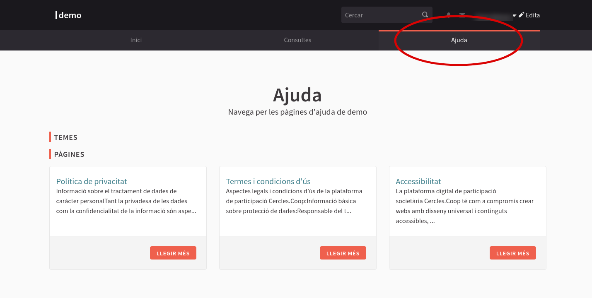
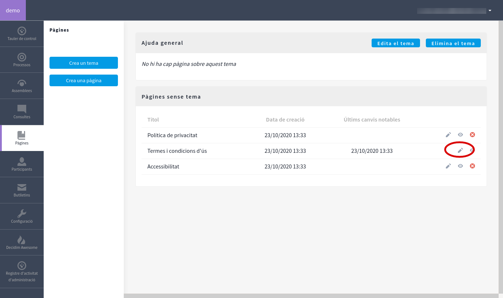
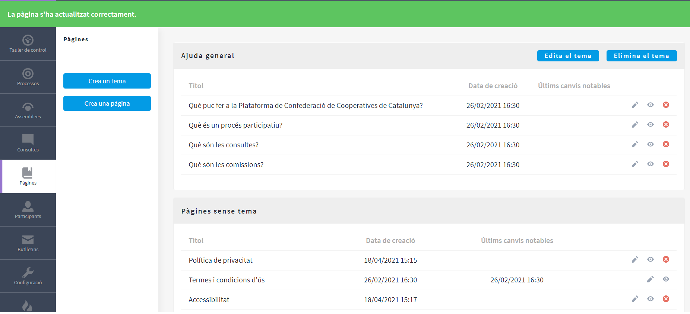
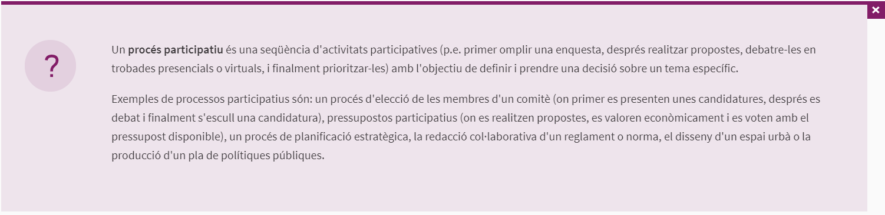

# Guia bàsica de la Plataforma Cercles.Coop

**Guia per a la posada en marxa de la instància pròpia a Cercles.Coop. Generar i configurar espais de participació societària i de gestió de les cooperatives**

## 1. INTRODUCCIÓ A LA PLATAFORMA

[Cercles.Coop](https://guia.cercles.coop/) és la plataforma de participació societària per a les cooperatives i Federacions de cooperatives que permet crear espais de participació digital: des de la convocatòria i votació electrònica a les Assemblees Generals fins a la realització de processos estratègics.
La plataforma és fruit d’una col·laboració público-cooperativa entre Decidim (impulsat per l’Ajuntament de Barcelona) i el moviment cooperatiu, a través de CoopCat. 

Cercles.Coop és una adaptació de [Decidim](https://guia.cercles.coop/#que-es-decidim) per adaptar la plataforma als requisits societàries i jurídics de les cooperatives i Federacions de cooperatives.

En aquesta guia trobareu una introducció als conceptes clau per gestionar la pròpia instància de Cerlces.Coop, i guiar-vos en les primeres passes per configurar els processos o espais de participació.

A cada apartat hi ha un exemple pràctic que pretén facilitar l’ús que es pot fer en l’àmbit del cooperativisme. Els exemples mostrats no són la única manera de portar a terme els processos participatius, doncs cada cooperativa i Federació de cooperatives pot adaptar el seu Cercles.Coop d’acord amb els seus procediments i necessitats.

## 2. QUINS USOS TÉ CERCLES.COOP?

Cercles.Coop s’adapta a les dinàmiques de les cooperatives i, per bé, que és una eina eminentment digital no té perquè substituir la vida societària a nivell presencial.

En aquest sentit, Cercles.Coop té dues funcions clarament definides. Per una banda, pot servir com a complement de les trobades presencials i, per tant, com a suport digital a les reunions, debats, jornades, assemblees.. I per una altra banda, permet desenvolupar en un entorn digital tots els processos de participació i presa de decisions, com ara: reunions en línia, vot electrònic, recollida de propostes, debats per comissions o sectorials...

Exemples d’iniciatives que podem desenvolupar amb Cercles.Coop:
* Reunions en línia.
* Assemblees Generals Ordinàries i Extraordinàries.
* Jornades, Conferències i altres actes públics amb la nostra base social i amb externs no socis.
* Procés participat de creació, debat i aprovació del Reglament de Règim Intern, Pla de Gestió, Pressupost...
* Enquestes de valoració i satisfacció.
* Espais interns de treball d’una comissió, grup de treball o sectorial...
* Emissió de vot electrònic.

## 3. CONCEPTES CLAU DE CERCLES.COOP

Cercles.Coop utilitza un llenguatge específic per definir les diferents possibilitats que ofereix per a la participació. A continuació, resumim breument què permet cada espai. 
La plataforma Cercles.Coop compta amb dues àrees diferenciades: l’àrea publica i l’àrea privada. 

**L’àrea pública** és la part on les sòcies poden accedir als diferents espais de participació que s’ofereixen, essent els més habituals:
* Els Processos participatius.
* Les Assemblees, enteses com espais estables de participació. No confondre amb les Assemblees pròpies de les cooperatives.
* Les Consultes, mecanisme segons el qual celebrem les Assemblees Generals de les cooperatives o altres reunions societàries que requereixin vot electrònic.

Tanmateix, navegant per l’àrea pública no es veuen aquests espais actius, ja que no es visualitzaran fins que no es creï contingut en cada un d’ells. Inicialment, però, el que es veurà és el contingut estàndard de portada i les pàgines d’ajuda més habituals. 

**L’àrea privada** és l’espai on administrar la instància pròpia de Cercles.Coop i, per tant, on crear els processos de participació, consultes o altres opcions de participació societària. Per accedir-hi, cal adreçar-se al menú d’usuari i a la part superior dreta hi ha l’entrada que dona accés al taulell d’administració. Es pot accedir a aquest taulell des del desplegable del menú personal, o bé clicant al botó **“Edita”** situat a la part superior dreta de la pàgina, tal i com es veu a la imatge següent:

Si és la primera vegada que accediu al taulell, caldrà acceptar els termes i condicions d’administració. Un cop acceptat, ja es visualitza el taulell d’administració i totes les opcions que permet Cercles.Coop i que s’ubiquen en el menú lateral esquerra. 


El rol d’administradora del sistema, dona capacitat per gestionar informació molt important, cal assegurar-se dues vegades abans de fer res.


En aquesta àrea privada (àrea d’administració) hi ha actius diversos mòduls i components que permeten definir els nostres espais i processos de participació, així com la configuració bàsica i avançada. 

El tauler d’administració conté les opcions següents:
* Processos: Mòdul per crear un espai o àmbit de participació
* Assemblees: Mòdul per crear un espai o àmbit de participació
* Consultes: Mòdul per crear un espai o àmbit de participació que requereix vot electrònic
* Pàgines: Edició del contingut de la secció ajuda, política d’ús...
* Participants: Gestió de la base social i de participació al Cercles.Coop
* Butlletins: Eina de comunicació a les persones enregistrades
* Configuració: Aspectes de configuració bàsica i avançada
* Awesome: Personalització d’espais

Vegem, a continuació, la diferència entre **mòduls** i **components**:

***Mòduls***
Són els espais de Participació o els àmbits on es desenvolupen i s’estableixen quins mecanismes s’habilitaran per participar. Les diferències entre ells es basen en la funcionalitat que tenen, la visualització que ofereixen i en si tenen la possibilitat d’establir fases. Hi ha tres mòduls per generar espais o àmbits de participació: Processos, Assemblees i Consultes. 

***Components***
Són els mecanismes que, dins els mòduls, ens permeten la participació dels socis i sòcies de la cooperativa i de la Federació. A cada Espai o àmbit de Participació es defineixen quins Components habilitar per a la participació. El significat i utilitat de cada Component s’explica detalladament més endavant. Existeixen onze tipus de Components:

* Pàgina
* Trobades
* Propostes
* Pressupostos
* Enquestes
* Seguiment 
* Debats
* Sortejos
* Blog
* Mapa global
* Iframe en pantalla completa

Altres conceptes clau que cal conèixer per desenvolupar-se dins la plataforma, son:

* Instància : Lloc web on s'instal·la la plataforma Cercles.Coop de l’entitat en qüestió. Cada cooperativa o Federació té la seva pròpia instància i és privada.
* Administradores : Persones que poden configurar i administrar la instància des del taulell d’administració. Poden crear nous processos participatius, posar noves per-sones administradores...
* Taulell d’administració: És l’espai del darrere de la plataforma (allò que no es veu), des d’on les administradores poden crear, configurar i gestionar les diferents possibi-litats del Cercles.Coop.
* Usuàries verificades : Són aquelles sòcies registrades a la instància que han passat un procés de verificació. Això permet establir diferents permisos segons si s’és o no una participant verificada, com per exemple poder votar en una consulta.
* Cens: És la base de dades sobre la qual es fan les verificacions. Es poden pujar des del taulell d’administració en format .csv
* Permisos: A cada component o espai de participació es poden establir uns permi-sos. Determinant qui pot accedir o no en aquell espai de la instància, això permet crear espai privats.
* Suports : Es poden donar suports a les propostes fetes. És a dir, es pot votar a favor d’aquella proposta.
* Categories: Serveixen per classificar continguts en els diferents espais o processos
de participació; també faciliten a les sòcies participants filtrar els continguts. 
* Àmbits: Les àrees organitzacionals de la cooperativa que podran vincular els pro-cessos participatius. 

**Esquema dels espais de participació i components programables del Tauler d’Administració de Cercles.Coop:**

| ESPAIS DE PARTICIPACIÓ *(Exemple pràctic)* | COMPONENT PROGRAMABLE |
| ------------- | ------------- |
| PROCESSOS *(Elaboració i aprovació del Pla de Gestió)* | Pàgina, Trobades, Propostes, Pressupostos, Enquestes, Seguiment, Debats, Sortejos, Blog, Mapa global, Iframe en pantalla completa |
| ASSEMBLEA *(Espai de treball d'òrgans societaris o de gestió: Consell Rector, Consell social...)*  | Pàgina, Trobades, Propostes, Pressupostos, Enquestes, Seguiment, Debats, Sortejos, Blog, Mapa global, Iframe en pantalla completa |
| CONSULTA *(Qualsevol òrgan societari o de gestió que requereixi emissió de vot electrò-nic: Assemblea General, Sectorial, Branca de producció...)*  | Vot delegat a Participants |

## 4. CONFIGURACIÓ BÀSICA: PÀGINES, APARENÇA, ÀMBITS

Abans de començar a configurar els espais de participació estables o els processos que vulgueu dinamitzar amb Cercles.Coop, és necessari repassar la configuració bàsica de la plataforma. Vegem-les:

## Pàgines

Les Pàgines són les seccions d’ajuda predefinides que es mostren des del menú principal a través de l’opció de menú **Ajuda**, o bé al peu de pàgina. 

Des d’aquest apartat, doncs, es poden editar, esborrar o crear noves pàgines. La finalitat d’aquestes no només és informar sobre els termes d’ús, política de privacitat i accessibilitat sinó també per explicar a la base social, com a usuaris de la plataforma, quina funció té cada procés participatiu que obrim des de la Plataforma.

Per defecte, tenim les **pàgines d’ajuda general** i les **pàgines sense tema**. Aquestes segones són les pàgines realment importants: són les que ens donen el marc legal per poder publicar continguts en la nostra plataforma. Per editar el contingut de pàgines existents cal clicant damunt de la icona llapis, tal i com es mostra a la imatge següent: 

Caldrà personalitzar la clàusula de protecció de dades amb la que treballarà la vostra cooperativa. Clicant [aquí](https://guia.cercles.coop/index-de-continguts-de-cercles.coop/posada-en-marxa#pagines-informatives) trobareu alguns models de plantilla.


Si la vostra instància de Cercles.Coop té més d’un **idioma** activat, cal parar atenció en l’idioma que s’està escrivint. A dalt a la dreta de cada capsa de text hi ha l’intercanviador d’idiomes. Caldrà revisar el text en cada un dels idiomes actius a la plataforma, si bé només és necessari completar el text en l’idioma predeterminat. Si es deixen els idiomes secundaris en blanc, es visualitzarà el contingut de  l’idioma principal.


Cal revisar les pàgines creades per defecte, es poden eliminar les que no siguin necessàries i modificar el contingut de les que puguin fer servei a la cooperativa.

Per visualitzar com es mostra la informació a l’àrea pública es pot fer de dues maneres, bé clicant sobre la icona en forma d’ull, bé a través del menú de navegació corresponent de l’àrea d’usuari. Per tornar al mode edició es pot fer clicant sobre la icona de llapis de l’àrea d’administració o bé clicant el botó **Edita** del menú de navegació d’usuari.

D’altra banda, les **pàgines d’ajuda general** tenen per finalitat explicar als socis quina funció té cada espai participatiu que generem (processos, assemblea, consulta). Vegeu exemples i la diferència entre **pàgines d’ajuda general i pàgines sense tema** a la imatge següent:

## Configuració

L’apartat **Configuració** de la instància també es troba al menú lateral del teu taulell d’administració, al clicar-la es desplega un submenú amb més opcions de configuració.

La primera secció permet configurar els conceptes bàsics de la instal·lació:
* El nom que li volem posar a la plataforma de participació,
* les xarxes socials del nostre projecte,
* l’idioma per defecte

o algunes personalitzacions com:
* **Habilitar ensenyes:** Les ensenyes són una millora d’usabilitat de la plataforma, fomenta la participació de les sòcies a partir d’assolir petits reptes.
* **Habilitar grups:** Permetre que diferents socis individuals creïn grups d’usuaris i publiquin a la plataforma a nom d’un col·lectiu. Aquesta opció està pensada per reconèixer la participació col·lectiva dins la plataforma. En l’àmbit de les cooperatives i les Federacions de cooperatives podrien ser col·lectius organitzats dins un grup d’usuaris: les comissions de treball, divisions d’activitat, sectorials, branques de producció...
* **Notificació de benvinguda:** Permet personalitzar el text del correu electrònic automàtic de benvinguda que s’envia a les persones que donem d’alta a la plataforma a través del [cens virtual de socis](https://guia.cercles.coop/index-de-continguts-de-cercles.coop/posada-en-marxa#importacio-del-cens-virtual-de-socis).

Per fer efectiu qualsevol canvi en aquesta pàgina de **Configuració**, cal clicar el botó **Actualitzar**.
 
 
## Aparença i pàgina d’inici

Dins del mateix mòdul i apartat de Configuració, trobem dos apartats molt relacionats entre ells, són: Aparença i Pàgina d’inici.

A **Aparença** trobarem diferents elements que podem configurar per personalitzar la interfície del nostre Cercles.Coop. Alguns d’aquests elements fan referència al contingut de portada, com la descripció, el botó d’acció principal de portada o el bàner de contingut ressaltat. A l’apartat Aparença, doncs, podem definir el contingut d’aquests elements. 

Més enllà d’aquests elements de portada, a la secció d’Aparença podem configurar elements que són transversals a tota la plataforma, com:
* El bàner omnipresent: Ens permet configurar una barra destacada a la part superior dreta de tota la plataforma. Serveix per destacar elements importants.
* L’aparença global: Com els logotips que es fan servir en diferents seccions de la pàgina o els colors de l’organització.
* També hi ha un apartat específic per afegir codi a la capçalera. Serà d’utilitat si es vol afegir codi de seguiment i analítica del tràfic web, o afegir codi css per personalitzar encara més la plataforma.

A l’apartat de **Pàgina d’inici** és on podrem reordenar i personalitzar la primera pàgina que veuran les sòcies que visitin, com a usuàries, la plataforma. Aquí el contingut està representat en diferents caixes distribuïdes entre el bloc de continguts actius i el bloc de contingut inactiu.

Algunes d’aquestes caixes es poden editar, com per exemple la **imatge del hero**, és a dir, la imatge principal de portada, sobre la qual apareixerà el botó d’acció si l’hem configurat abans.

Movent les caixes, amunt i avall, es reordena el contingut de la portada i, per tant, els canvis es visualitzaran de manera instantània.


Cal no canviar el contingut de la caixa Bloc HTML, ja que conté configuració predeterminada de Cercles.Coop.


## Àmbits i àrees

Els [àmbits i les àrees](https://guia.cercles.coop/index-de-continguts-de-cercles.coop/posada-en-marxa#ambits) són dos mecanismes que permeten classificar els espais de participació.

Podem definir els àmbits segons la seva tipologia. Per defecte, a Cercles.Coop  es proposa fer servir l’àmbit reunions societàries per classificar totes les reunions societàries que requereixen vot electrònic, però es poden crear tants àmbits com ens siguin necessari.

Per a les cooperatives amb diverses divisions d’activitat o diversificació territorial, serà útil fer servir aquesta classificació, per diferenciar àmbits organitzatius i àmbits territorials.

També es pot organitzar per Àrees. Aquesta opció permet mostrar l’organització temàtica de la cooperativa. La configuració i classificació per àrees no és obligatòria, serà útil per a cooperatives amb diverses divisions d’activitat o amb gran diversitat organitzativa a nivell intern. Per defecte, a Cercles.Coop es proposa l’àrea d’Assemblea general per agrupar les assemblees que es van desenvolupant.


En alguns casos (com la realització de les Assemblees o altres reunions societàries a través de les Consultes, que requereixen vot electrònic) és obligatori definir un tipus d’àmbit i d’àrea.


## Els missatges d’ajuda

Finalment, a l’apartat de **Configuració**, hi ha un últim element per personalitzar: Les **seccions d’ajuda**. Les seccions d’ajuda conté les caixes de text amb la informació contextual que apareix mentre naveguem per la plataforma, com a usuàries, i expliquen què son cada un dels espais de participació que anem habilitant.

Cal revisar les descripcions proposades i adapta-les a la realitat de participació de la cooperativa.

## Participants

El mòdul **Participants** del menú principal de l’àrea d’administració permet consultar les persones que estan donades d’alta a la Plataforma i que, per tant, tenen accés, com a usuàries, a tots els espais de participació que tenim actius a l’àrea pública.
L’adaptació Cercles.Coop, a diferència del Decidim, no permet que les persones s’enregistrin automàticament a la instància del Cercles.Coop. Aquesta opció de registrar usuàries sempre serà una acció dirigida per la cooperativa. 
A través d’aquest mòdul podem gestionar les accions següents:

*	**Administradores:** apartat a través del qual incorporar noves administradores de la instància pròpia de Cercles.Coop. Tenir permisos d’administrador permet configurar la instància, però no atorga automàticament capacitat per participar com a usuari en els diferents processos participatius.
*	**Participants:** apartat on consultar les sòcies i no sòcies que tenen accés com a usuàries de la plataforma.
*	**Impersonacions**
*	**Verificacions**
*	**Verificació directa:** apartat a través del qual incorporem les sòcies que volem donar d’alta com a usuàries de la plataforma. A través d’aquest apartat és on també autoritzem les sòcies amb dret a vot a les reunions societàries que requereixin vot electrònic. Vegeu com fer-ho [aquí](https://guia.cercles.coop/index-de-continguts-de-cercles.coop/posada-en-marxa#importacio-del-cens-virtual-de-socis).
•	**Delegacions:** apartat a través del qual programem la delegació de vot en aquelles reunions societàries que requereixin vot electrònic. Vegeu com fer-ho [aquí](https://guia.cercles.coop/index-de-continguts-de-cercles.coop/posada-en-marxa#delegacions-de-vots).

