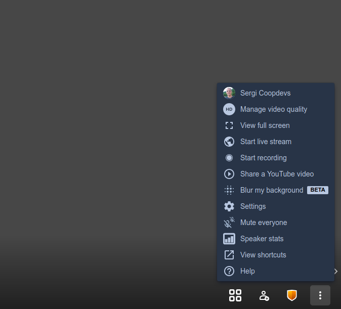
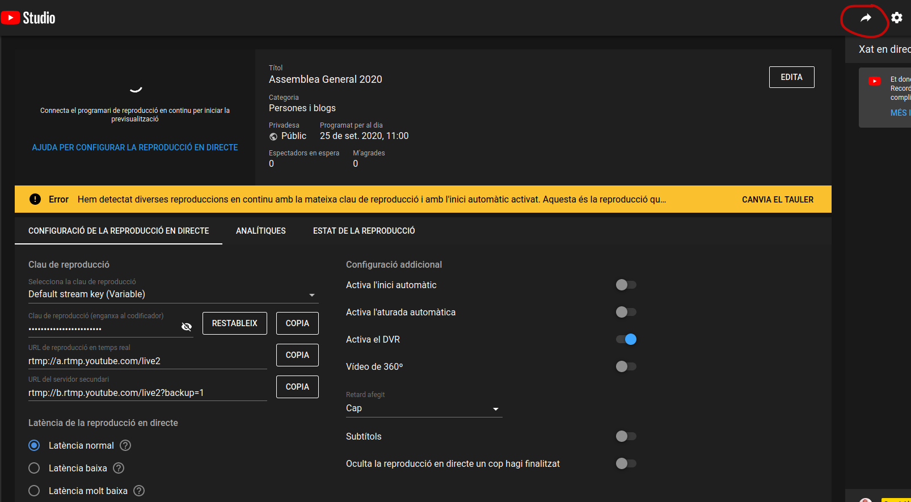
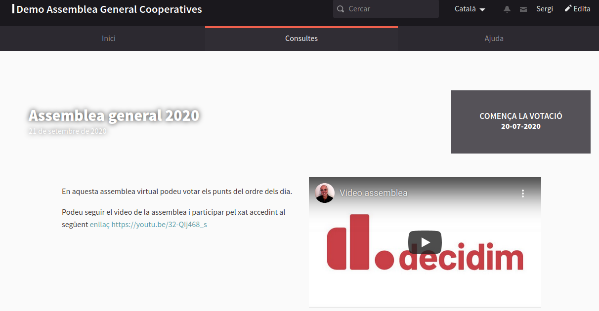

# Mode broadcasting

### Emetre la videoconferència en directe a través de youtube 

Youtube és el servei més extensament utilitzat per emetre vídeo en directe. Alguns dels sistemes de videoconferència ja incorporen opcions per emetre el vídeo de la videoconferència a través d'un vídeo de youtube. Tot i això, cal tenir present que es poden utilitzar altres sistemes, com el Vimeo, però per no complicar aquesta guia ens centrarem només en el sistena de broadcasting via youtube. 

L’objectiu d’aquest sistema de broadcasting és realitzar la videoconferència amb les conductores de la reunió a través de alguna de les eines esmentades a [videoconferència](./) i, en temps real, emetre aquesta videoconferència a través de youtube perquè qualsevol persona que tingui l'enllaç la pugui seguir.

No podem esperar realitzar una reunió estrictament privada emetent per youtube. Tot i que youtube permet configurar una emissió en directe com "Privada" això només significa que no apareixerà als resultats de les cerques a youtube, però qualsevol persona amb l'enllaç podrà veure la emissió, ja que no hi ha un sistema de verificació d’accés d’usuari únic identificable. Si necessitem privadesa necessitarem un sistema de [Webinar](mode-webinar.md) \en el cas de més de 10 socis, o un sistema simple de videoconferència, en el cas de 10 o menys socis.

#### 1. Configurar canal de youtube

Cal tenir un compte de Google \(com per exemple un compte de gmail\) i [complir un seguit de requisits per tal de poder emetre vídeos en directe](https://support.google.com/youtube/answer/2474026?co=GENIE.Platform%3DDesktop&hl=ca&oco=0). 

#### 2. Planificar un video en directe

1. Accedim a [YouTube Studio](http://studio.youtube.com/).
2. A la part superior dreta, fem clic a Emet en directe  per obrir la Sala de control en directe.
3. Fem clic a la pestanya amb la icona de calendari: **Gestiona**.
4. Fem clic a **Programa una reproducció en directe**.
5. Omplim el formulari amb les nostres dades tal i com es mostra a les imatges següents:

**En el moment d'iniciar la reproducció en directe, necessitarem disposar de la "clau de reproducció", que podem copiar fen clic al botó tal i com es mostra a la imatge.** 

### Opcions per connectar sistemes de videoconferència a l'emissió en directe de youtube

A continuació es detallen sistemes de videoconferència amb connector directe a youtube:

#### Zoom

A la[ següent guia trobareu l'explicació de com fer-ho](https://support.zoom.us/hc/es/articles/360028478292-Transmisi%C3%B3n-de-una-reuni%C3%B3n-o-seminario-web-en-YouTube-Live)

#### Jitsi 

Quan estiguem a la sala de videoconferència, fent clic als tres punts verticals que trobareu a baix a la dreta, seleccionar l'opció **start live creen** (iniciar la reproducció en directe) i enganxar la **clau de reproducció** que hem obtingut a youtube [tal com hem explicat](mode-broadcasting.md#2-planificar-un-video-en-directe)anteriorment. Aleshores, s'emetrà el vídeo resultant,així qualsevol soci o convidat podrà seguir la reunió. Les emissions en directe de youtube compten amb un sistema de participació via xat que permet moderació.

Altres opcions: 

Quan l’opció d’emetre vídeo a traves de youtube no estigui disponible al sistema de videconferència necessitarem emprar algun sistema que ens permeti capturar el vídeo de la videoconferència i enviar la informació a youtube. Per a això, podem utilitzar el programari lliure [OBS](https://obsproject.com/) per capturar qualsevol vídeo de qualsevol sistema de videoconferències i emetre'l a través de youtube. Per exemple [aquí teniu una explicació de com fer-ho si fem servir Skype](https://www.hackdiary.com/2019/01/22/stream-to-youtube-live-from-a-skype-call/).

OBS permet, a més, editar vídeo en directe, per exemple: per afegir caràtules que descriguin qui està parlant o introduint diferents fases de la reunió. 

### Compartir el vídeo de youtube

Fent clic a dalt a la dreta, podeu compartir l'enllaç de youtube que permetrà als espectadors veure el vídeo i participar al xat, serà un enllaç del tipus [https://youtu.be/32-QIj468\_s](https://youtu.be/32-QIj468_s) i aquest enllaç el podrem enviar juntament amb la convocatoria de la reunió.

### Mostrar el vídeo de youtube a la Plataforma Cercles Coop de Decidim

Per a més comoditat, podem mostrar el vídeo a la plataforma de votació Cercles Coop de Decidim, ja que d’aquesta manera queda tot integrat en un únic espai. Ho podem fer entrant a l’àrea d'administració de la plataforma de votació a **Consultes &gt; Consulta en qüestió** i editem els següents camps: 

* Descripció: En la pròpia descripció podem afegir el link a youtube que hem obtingut abans.
* URL de vídeo introductori: En aquest cas hem de variar la URL, si la URL que vam obtenir era  [https://youtu.be/32-QIj468\_s](https://youtu.be/32-QIj468_s) hem de introduir [https://www.youtube.com/embed/32-QIj468\_s](https://www.youtube.com/embed/32-QIj468_s). És a dir, cal substituir **https://youtu.be/** per **https://www.youtube.com/embed/**

El resultat, a la pàgina, serà similar a: 

 

